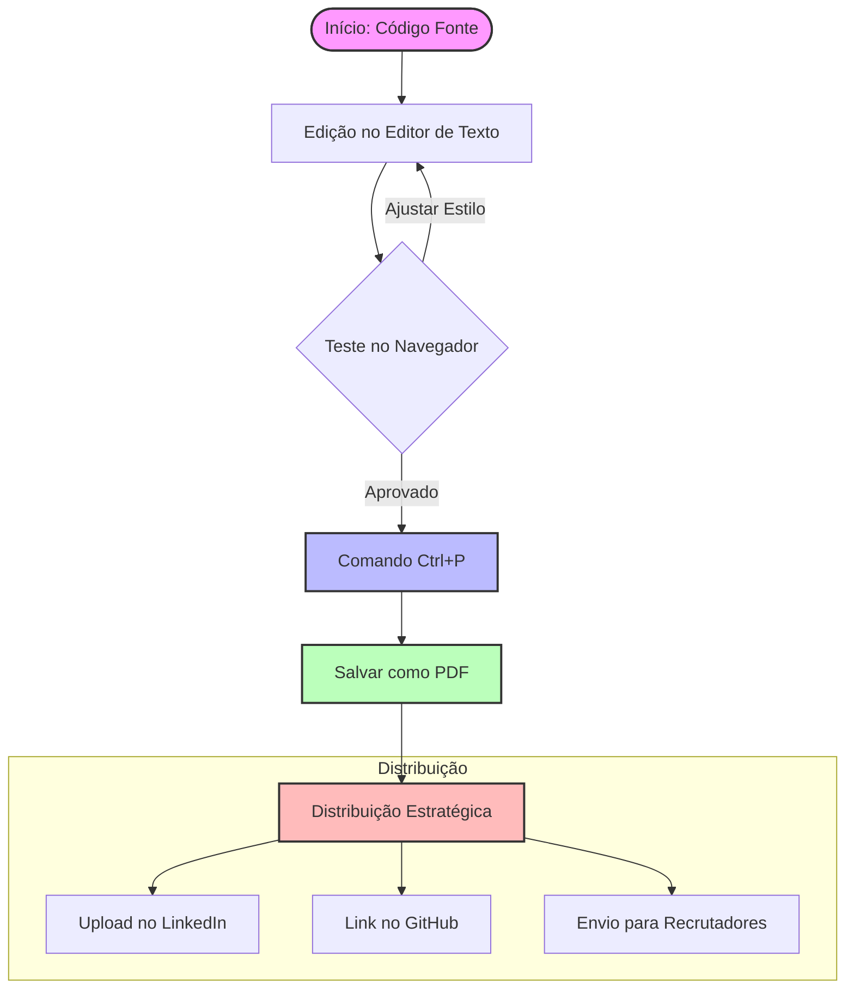

# 📄 Ciclo de Vida do Currículo Profissional (HTML para PDF)

Este guia explica o fluxo técnico utilizado para criar, converter e publicar o currículo profissional deste repositório.

## 🔄 Fluxograma do Processo

### 🛠️ Por que usar HTML para Currículo?

| Vantagem | Explicação Técnica |
| :--- | :--- |
| **Customização** | Controle total sobre cores, fontes e espaçamentos via CSS. |
| **Portabilidade** | O arquivo HTML pode ser aberto em qualquer computador sem perder a formatação. |
| **Modernidade** | Demonstra para o recrutador que você domina tecnologias Web (HTML/CSS). |
| **Acessibilidade** | Facilita a leitura por sistemas automáticos de triagem de currículos (ATS). |

## 🎓 Exercício de Atualização
Sempre que você conquistar uma nova **Certificação** (como a da Estácio) ou finalizar um **Projeto**, siga este fluxo:
1. Abra o `curriculo_arkell.html`.
2. Adicione a nova informação no código.
3. Gere um novo PDF.
4. Atualize seus perfis online.
