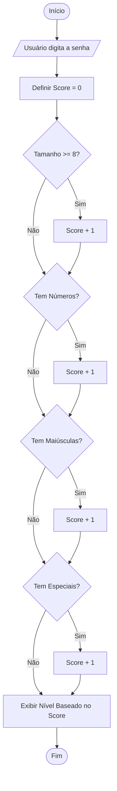
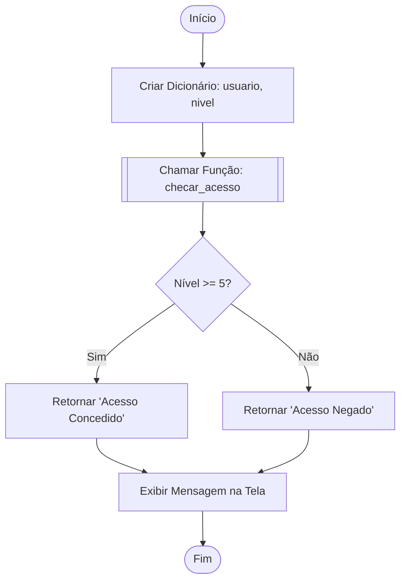

# 🧠 Estudos de Lógica de Programação - Bootcamp TOTVS

Este documento contém a representação visual da lógica dos sistemas desenvolvidos neste repositório.

---

## 1. Verificador de Força de Senha 🛡️
Este fluxo mostra como o programa analisa cada critério para dar uma nota à senha.



---

## 2. Sistema de Segurança (Dicionários + Funções) 🔑
Como o programa "pensa" ao receber um objeto de usuário e decidir o acesso.



---

## 3. Gerenciador de Tarefas (CRUD + Persistência JSON) 📝
O ciclo completo de como os dados saem do HD, são editados e voltam para o HD.

```mermaid
graph STR
    Start([Abrir Programa]) --> Load[Carregar tarefas.json]
    Load --> Menu{Escolha uma Opção}
    
    Menu -- 1. Adicionar --> Add[Pedir Nome -> Adicionar na Lista]
    Add --> Save[Salvar tarefas.json]
    Save --> Menu
    
    Menu -- 2. Listar --> List[Loop FOR: Mostrar Tabela]
    List --> Menu
    
    Menu -- 3. Concluir --> Comp[Pedir ID -> Mudar Status]
    Comp --> Save
    
    Menu -- 4. Remover --> Rem[Pedir ID -> Remover da Lista]
    Rem --> Save
    
    Menu -- 5. Sair --> End([Fechar Programa])
```

---

### 💡 Dica de Estudo:
Tente olhar para esses desenhos e imaginar qual linha de código em Python representa cada "caixinha" do fluxograma. Isso vai te ajudar a "ler" algoritmos no futuro de forma muito mais rápida!
