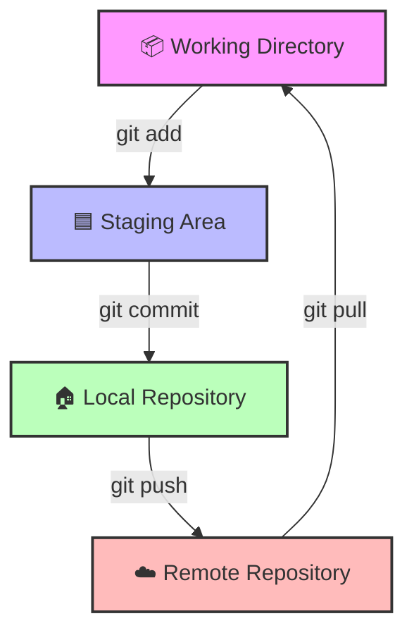

# 🚩 Guia Rápido de Git - Bootcamp TOTVS

Este guia resume o fluxo de trabalho essencial utilizado neste repositório.

## 🔄 Fluxograma do Workflow Git

No GitHub, este código abaixo será renderizado como um gráfico:

### 🗝️ Comandos Essenciais

| Comando | O que faz? | Analogia |
| :--- | :--- | :--- |
| `git status` | Verifica o que mudou | "O que tem de novo na mesa?" |
| `git add .` | Prepara os arquivos | "Colocar as cartas no envelope" |
| `git commit -m "..."` | Registra a mudança | "Carimbar e fechar o envelope" |
| `git push origin main` | Envia para o servidor | "Entregar nos Correios" |
| `git log --oneline` | Mostra o histórico | "Ver o recibo das entregas" |

## 🎓 Exercício Prático
1. Crie um arquivo chamado `teste.txt`.
2. Digite `git status` e veja o arquivo em vermelho.
3. Digite `git add teste.txt`.
4. Digite `git status` e veja o arquivo em verde (Staged).
5. Digite `git commit -m "test: meu primeiro commit manual"`.
6. Digite `git push origin main`.
