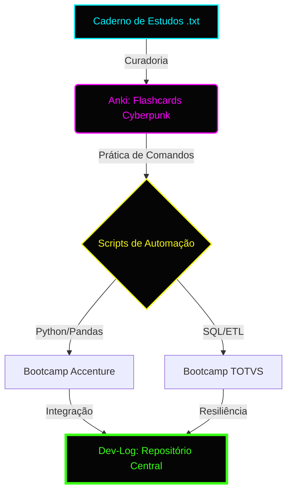

# 🌐 DECODER_PROJECT: Dev-Log & Data Architecture
### *“O futuro já chegou, só não foi distribuído uniformemente.”*

---

## 🎓 Formação & Bootcamps (Upgrade Progress)

- **[SUCCESS]** 🚀 **TOTVS Bootcamp** | [Acessar Pasta](./bootcamps/totvs)
- **[LOADING]** 🐍 **Accenture** | [Acessar Pasta](./bootcamps/accenture)
- **[NEW]** 📓 **DIO Challenge** | [Miniguia de Estudos: NotebookLM](./desafios/notebooklm)

### 📊 Status de Evolução Técnica (Study Progress)
| Bootcamp / Skill | Status | Barra de Progresso |
| :--- | :--- | :--- |
| **TOTVS (Data Eng)** | `SUCCESS` |  |
| **Accenture (Python)** | `LOADING` |  |
| **Anki (Sintaxe/Teoria)** | `ACTIVE` |  |

### 🚀 Roadmap de Conhecimento (Learning Flow)

---

## 🏗️ Projeto de Destaque: Pipeline ETL & Disaster Recovery
*Visualização de Fluxo de Dados e Resiliência em Tempo Real*

1. **Camada de Dados:** MySQL (MariaDB) Transacional.
2. **Processamento:** Pandas Engine para Limpeza e Transformação.
3. **Resiliência:** `recovery_manager.py` (Failover para JSON/CSV).

---

## 📂 Projetos Ativos & Estrutura

### 📁 [bootcamps](./bootcamps)
> Repositório das formações TOTVS e Accenture.

### 📁 [projetos](./projetos)
> Projetos core de Machine Learning e SQL.

### 📁 [desafios](./desafios)
> Desafios de curta duração (Ex: NotebookLM).

### 📁 [recursos](./recursos)
> Materiais de apoio, estudos e o Deck de Flashcards Anki.

---

## 🛠️ Tech Stack: System Components
- **Core:** Python, PHP, SQL, PowerShell.
- **Data Science:** Pandas, Scikit-Learn.
- **Environment:** Windows 11 (HUD Optimized) / WSL2 Debian.

---
*C:\Users\User\dev-log> systemctl status repo_integrity*
🟢 **Active: Operational** | *Last update: Today*
