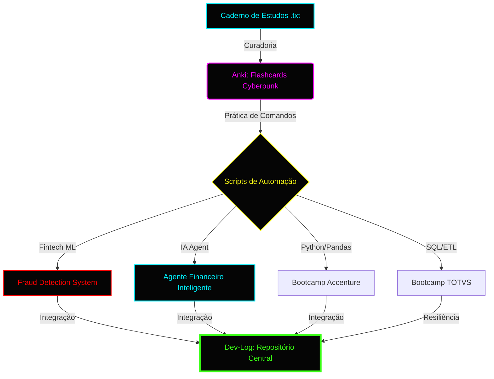

# 🌐 DECODER_PROJECT: Dev-Log & Data Architecture
### *“O futuro já chegou, só não foi distribuído uniformemente.”*

---

## 🎓 Formação & Bootcamps (Upgrade Progress)

- **[SUCCESS]** 🚀 **TOTVS Bootcamp** | [Acessar Pasta](./bootcamps/totvs)
- **[SUCCESS]** 🐍 **Accenture** | [Acessar Pasta](./bootcamps/accenture)
- **[NEW]** 📓 **DIO Challenge** | [Miniguia de Estudos: NotebookLM](./desafios/notebooklm)

### 📊 Status de Evolução Técnica (Study Progress)
| Bootcamp / Skill | Status | Barra de Progresso |
| :--- | :--- | :--- |
| **TOTVS (Data Eng)** | `SUCCESS` |  |
| **Accenture (Python)** | `LOADING` |  |
| **Anki (Sintaxe/Teoria)** | `ACTIVE` |  |

### 🚀 Roadmap de Conhecimento (Learning Flow)

---

## 🏗️ Projetos de Destaque (System Architecture)

### 🛡️ I. Agente Financeiro Inteligente (AI Agent)
*Planejamento Financeiro Personalizado com IA Generativa (RAG)*

1. **Inteligência:** IA consultiva que integra perfil do investidor e histórico de gastos.
2. **Segurança:** Sistema anti-alucinação baseado em base de conhecimento (CSV/JSON).
3. **Interface:** Chat interativo em tempo real via Streamlit.
4. **Localização:** [Acessar Projeto](./projetos/agente_financeiro)

### 🛡️ II. Fraud Detection System (Fintech Solution)
*Sistema de Monitoramento e Inteligência para Detecção de Fraudes Financeiras*

1. **Algoritmo:** Classificador XGBoost otimizado para dados imbalanced.
2. **Localização:** [Acessar Projeto](./projetos/fraud-detection)

### 🛡️ III. Pipeline ETL & Disaster Recovery
*Visualização de Fluxo de Dados e Resiliência em Tempo Real*

1. **Resiliência:** `recovery_manager.py` (Failover para JSON/CSV).
2. **Localização:** [Acessar Pasta](./projetos/machine_learning/projects/pipeline_etl)

---

## 📂 Projetos Ativos & Estrutura

### 📁 [bootcamps](./bootcamps)
> Repositório das formações TOTVS e Accenture.

### 📁 [projetos](./projetos)
> Projetos core: Agente Financeiro, Fraud Detection e Pipeline ETL.

### 📁 [desafios](./desafios)
> Desafios de curta duração (Ex: NotebookLM).

### 📁 [recursos](./recursos)
> Materiais de apoio, estudos e o Deck de Flashcards Anki.

---

## 🛠️ Tech Stack: System Components
- **Core:** Python, PHP, SQL, PowerShell.
- **Data Science:** Pandas, Scikit-Learn.
- **Environment:** Windows 11 (HUD Optimized) / WSL2 Debian.

---
*C:\Users\User\dev-log> systemctl status repo_integrity*
🟢 **Active: Operational** | *Last update: Today*
