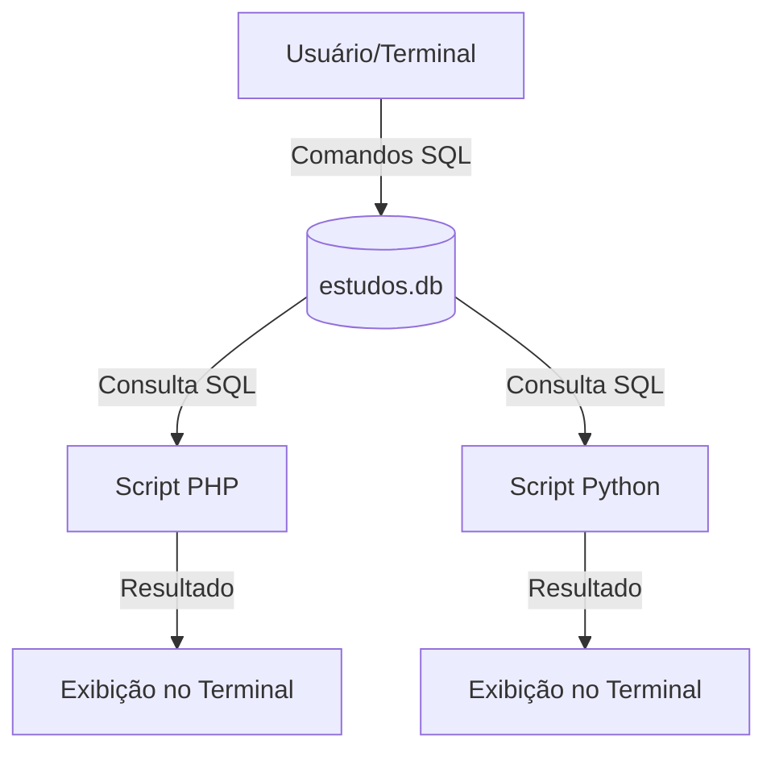

# Fluxograma de Integração: SQL, PHP e Python

## Descrição do Fluxo
1. **Banco de Dados (SQL):** Centraliza as informações dos alunos no arquivo `estudos.db`.
2. **PHP:** Conecta ao SQLite, executa a consulta e exibe os dados.
3. **Python:** Conecta ao SQLite nativamente, executa a consulta e exibe os dados.
4. **Integração:** Ambas as linguagens leem a mesma fonte de dados, garantindo consistência.
