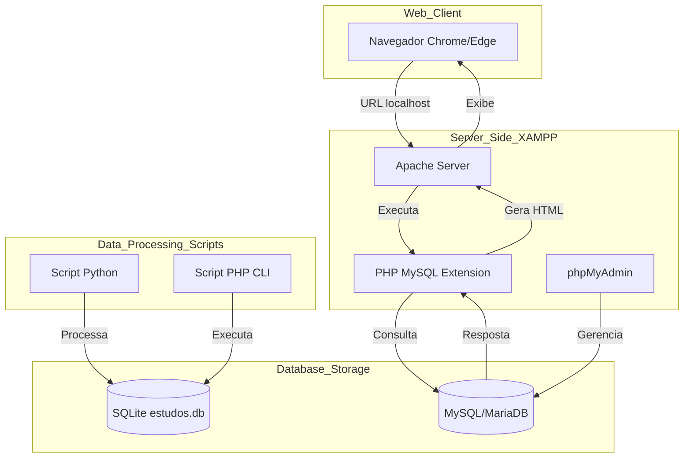

# Fluxograma do Sistema Integrado

## Fluxo de Dados:
1. **Navegador:** O usuário acessa a página PHP no localhost.
2. **Servidor (Apache/PHP):** Processa o código PHP.
3. **Conector:** O PHP busca dados no banco MySQL (XAMPP).
4. **Retorno:** O PHP envia o HTML final para o navegador.
5. **Automação:** Scripts Python e PHP-CLI operam diretamente nos arquivos SQLite locais.
