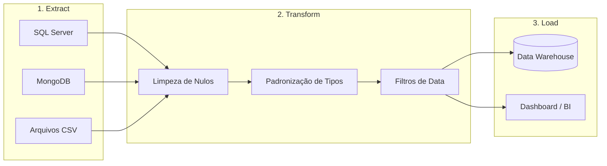
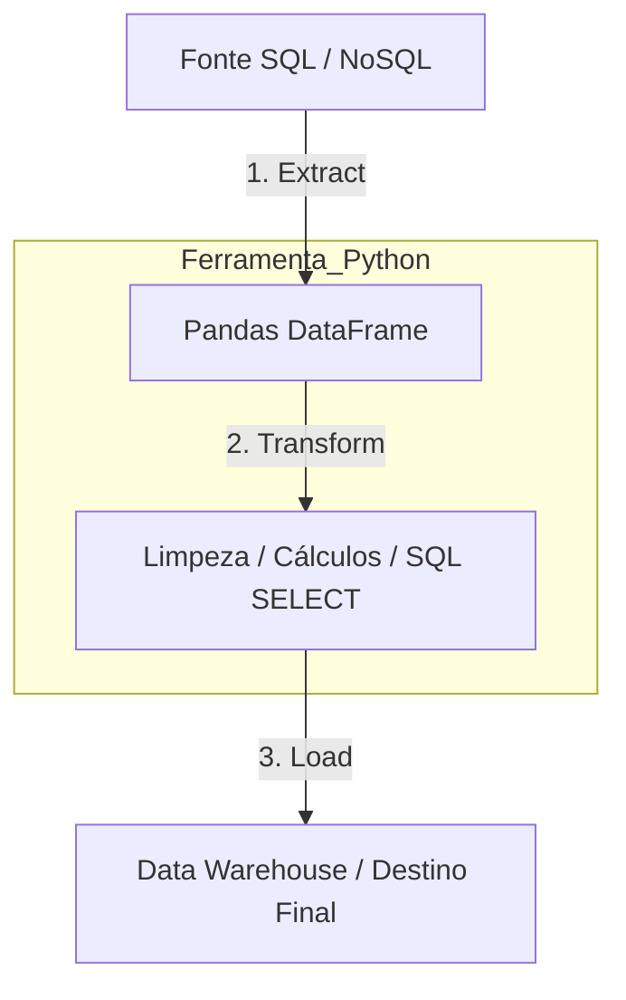

# Estudos de ETL (Extract, Transform, Load)

O ETL é o "coração" da integração de sistemas. Ele permite que dados de diferentes origens trabalhem juntos.

## 09. O Fluxo de Dados (Pipeline)

## 10. Exemplo Prático de Transformação

**Dado Bruto (Extraído):**
`{ "nome": "arkell", "data": "19/03/26", "valor": "R$ 100,00" }`

**Transformação Necessária:**
1. Nome para Maiúsculo (`ARKELL`).
2. Data para padrão ISO (`2026-03-19`).
3. Valor para Float Puro (`100.00`).

**Dado Final (Carregado):**
`{ "nome": "ARKELL", "data": "2026-03-19", "valor": 100.00 }`

---

## 11. Data Warehouse (DW) e Carga (Load)

**Definição Literal de Data Warehouse:** Um repositório centralizado de dados otimizado para **leitura e análise estratégica**. Ao contrário de um banco de dados operacional (SQL/NoSQL), o DW armazena dados históricos que não são mais alterados.

### O Papel do Python (Pandas) no ETL

O **Pandas** atua como a ferramenta de processamento em memória que executa o pipeline.

### Comandos Essenciais (Integração):

*   **`pd.read_sql()`**: O Python executa um comando `SELECT` no banco e o Pandas carrega os resultados em uma tabela na memória (DataFrame).
*   **`.str.upper() / .fillna()`**: O Pandas transforma os dados (limpeza de nomes ou preenchimento de valores vazios).
*   **`df.to_sql()`**: O Pandas executa a fase de **Load**, gravando os dados limpos no Data Warehouse.

**Limite Técnico:** O Pandas faz toda a transformação na memória RAM do computador antes de enviar o dado final para o disco rígido do Data Warehouse.

---
