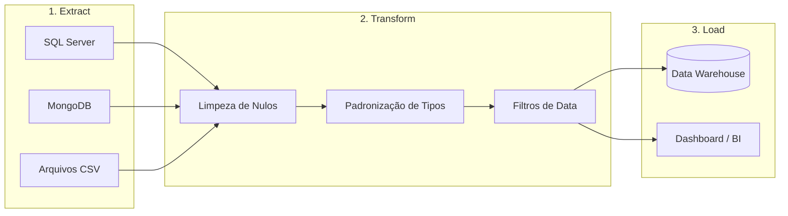

# Estudos de ETL (Extract, Transform, Load)

O ETL é o "coração" da integração de sistemas. Ele permite que dados de diferentes origens trabalhem juntos.

## 09. O Fluxo de Dados (Pipeline)

## 10. Exemplo Prático de Transformação

**Dado Bruto (Extraído):**
`{ "nome": "arkell", "data": "19/03/26", "valor": "R$ 100,00" }`

**Transformação Necessária:**
1. Nome para Maiúsculo (`ARKELL`).
2. Data para padrão ISO (`2026-03-19`).
3. Valor para Float Puro (`100.00`).

**Dado Final (Carregado):**
`{ "nome": "ARKELL", "data": "2026-03-19", "valor": 100.00 }`

---
