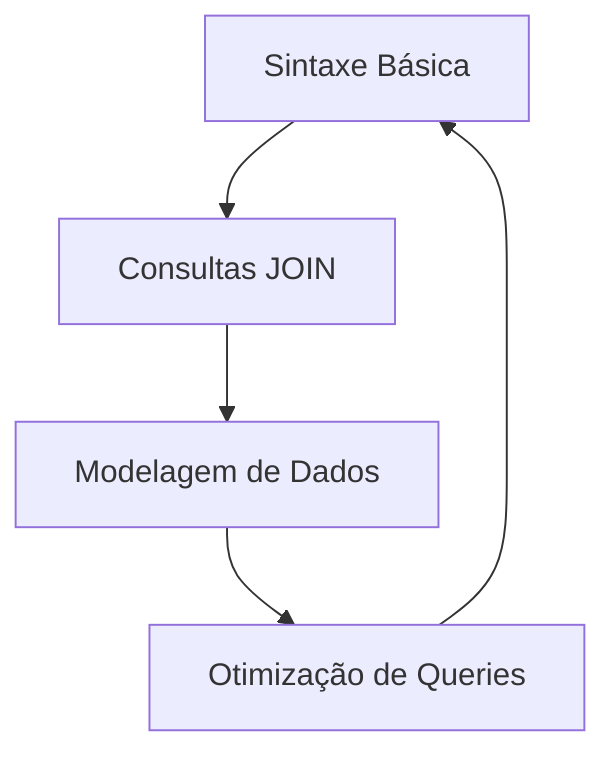
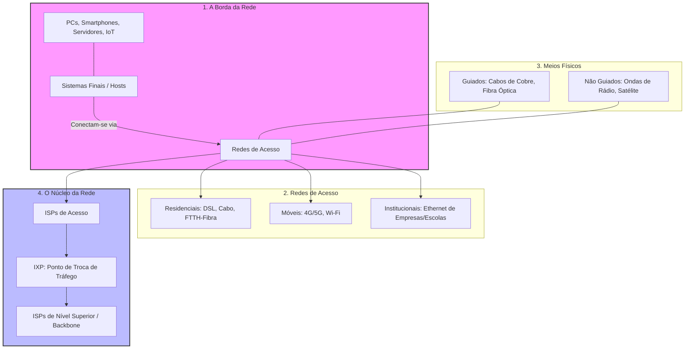

# Caderno de Fluxogramas: Engenharia de Dados

Este diretório contém diagramas e fluxogramas para auxiliar na visualização de processos técnicos.

## 01. Ciclo de Estudo SQL

## 02. Arquitetura de Redes: A Borda e o Núcleo

Este fluxograma divide a internet em suas partes físicas e lógicas fundamentais.

### Explicação Teórica Direta (Definições de Limites)

1.  **Sistemas Finais (Hosts):** São os dispositivos que nós usamos (computadores, celulares). Eles ficam na "borda" porque são o ponto inicial ou final de qualquer dado.
2.  **Redes de Acesso:** É o caminho físico que liga o seu dispositivo ao primeiro roteador do seu provedor (ISP). 
    *   **Residenciais:** Conexões domésticas.
    *   **Institucionais:** Redes de empresas ou universidades.
3.  **Meios Físicos:** 
    *   **Guiados:** O sinal viaja dentro de um sólido (fio de cobre ou vidro da fibra).
    *   **Não Guiados:** O sinal viaja pelo ar (wireless).
4.  **Núcleo da Rede:** É a "malha" de roteadores que interconectam as redes de acesso em todo o mundo.
5.  **ISP (Internet Service Provider):** É a empresa (ex: Vivo, Claro) que te fornece acesso. Elas são organizadas em hierarquia (locais se conectam a regionais, que se conectam a globais).
6.  **IXP (Internet Exchange Point):** É um local físico onde diferentes ISPs se encontram para trocar dados diretamente entre si, tornando o tráfego mais rápido e barato.

---
*Organizado por Gemini CLI*
