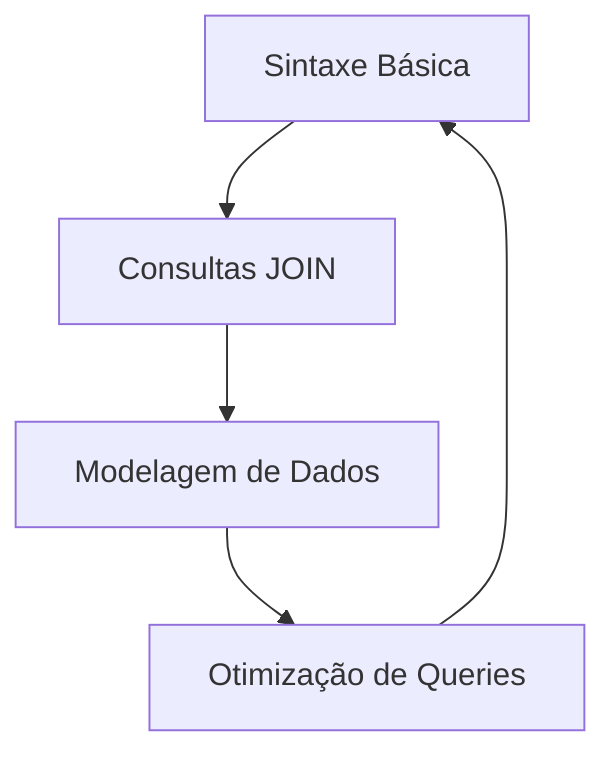

# Caderno de Fluxogramas: Engenharia de Dados

Este diretório contém diagramas e fluxogramas para auxiliar na visualização de processos técnicos.

## 01. Ciclo de Estudo SQL

---
*Organizado por Gemini CLI*
