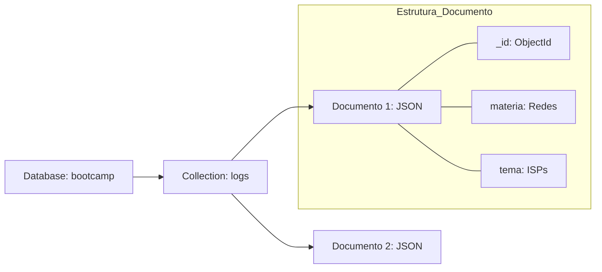
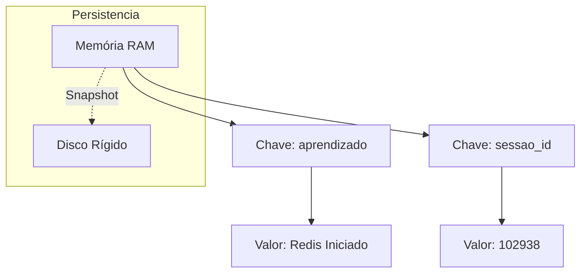

# Estudos de Bancos de Dados NoSQL

Este documento contém a base teórica, visual e prática sobre bancos de dados não relacionais.

## 05. Metodologia NoSQL: Definição e Riscos

**Definição Literal:** NoSQL (*Not Only SQL*) define sistemas de banco de dados que não utilizam o modelo de tabelas fixas e relações (JOINs) do SQL tradicional. Eles são focados em escalabilidade e flexibilidade.

| Característica | NoSQL (Documento/Chave-Valor) | SQL (Relacional) |
| :--- | :--- | :--- |
| **Estrutura** | Dinâmica (JSON ou Chaves) | Fixa (Tabelas e Colunas) |
| **Escalabilidade** | Horizontal (Mais servidores simples) | Vertical (Um servidor mais potente) |
| **Consistência** | Eventual (Pode demorar a atualizar) | Imediata (Sempre atualizado) |

### Riscos do NoSQL (Limites de Segurança)
1. **Falta de Esquema (Schema-less):** Se você não for organizado, o banco vira uma "bagunça" de dados diferentes na mesma coleção.
2. **Consistência Eventual:** Em sistemas distribuídos, um usuário pode ler um dado que ainda não foi totalmente atualizado em todos os servidores.
3. **Dependência de Chave:** No Redis, se você perder a chave exata, o dado é virtualmente impossível de encontrar sem varrer toda a memória.

---

## 06. MongoDB (Orientado a Documentos)

O MongoDB armazena dados em documentos **JSON**. É ideal para dados que mudam de estrutura frequentemente.

### Exercício Prático Realizado:
1. `use bootcamp`
2. `db.logs.insertOne({ nome: "Arkell", curso: "Engenharia de Dados" })`
3. `db.logs.find()`

---

## 07. Redis (Chave-Valor em Memória)

O Redis é um banco de dados que vive na memória RAM. É usado para velocidade extrema (Cache).

### Exercício Prático Realizado:
1. `SET aprendizado "Redis Iniciado"`
2. `GET aprendizado`
3. `EXPIRE aprendizado 60` (O dado sumirá em 1 minuto)

---

## 08. Resumo da Metodologia de Aprendizado (O Martelo)

Para deixar de usar a CLI como "muleta" e passar a usá-la como "martelo":
1. **Entender o Caminho:** Saber onde o executável está (`C:\Program Files\Redis`).
2. **Comando de Chamada:** Usar o operador `&` para caminhos com espaços no PowerShell.
3. **Interação Manual:** Abrir o Shell (`mongosh` ou `redis-cli`) e digitar os comandos sem auxílio automatizado.
