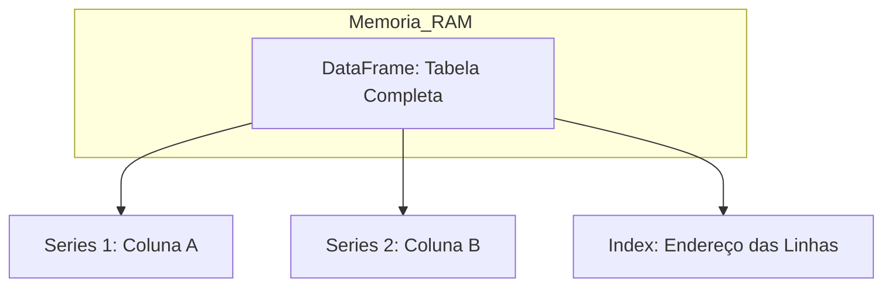

# Estudos de Python: Biblioteca Pandas

O Pandas é utilizado para carregar, limpar e analisar dados em formato de tabela (DataFrames).

## 13. Anatomia de um DataFrame

## 14. Comandos Essenciais (O Martelo)

| Função | O que faz (Literal) | Equivalente SQL |
| :--- | :--- | :--- |
| `pd.read_csv()` | Lê um arquivo e cria um DataFrame. | `FROM arquivo.csv` |
| `df.head()` | Mostra as primeiras 5 linhas. | `LIMIT 5` |
| `df['coluna']` | Seleciona uma coluna específica (Series). | `SELECT coluna` |
| `df[df['valor'] > 10]` | Filtra linhas baseadas em uma condição. | `WHERE valor > 10` |
| `df.groupby()` | Agrupa dados para cálculos. | `GROUP BY` |
| `df.merge()` | Une dois DataFrames. | `JOIN` |

### Limites e Riscos do Pandas:
1. **Memória RAM:** O Pandas carrega **todo** o arquivo na memória. Se o arquivo for maior que a sua memória RAM (ex: 16GB), o computador vai travar.
2. **Tipagem:** O Pandas tenta adivinhar o tipo de dado (Número ou Texto). Se ele errar, os cálculos matemáticos falharão.

---
