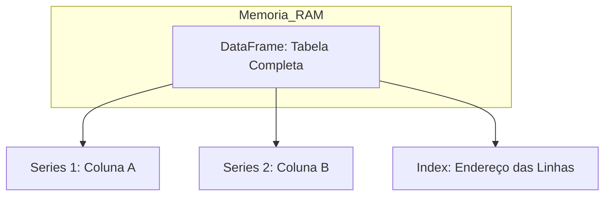

# Estudos de Python: Biblioteca Pandas

O Pandas é utilizado para carregar, limpar e analisar dados em formato de tabela (DataFrames).

## 13. Anatomia de um DataFrame

### Diferença entre Series (Estrutura) e Dtype (Conteúdo)

| Conceito | Definição Literal | Limite Técnico |
| :--- | :--- | :--- |
| **Series** | É a **coluna física** onde os dados ficam guardados. | Um DataFrame é um conjunto de várias Series. |
| **Dtype (Data Type)** | É o **tipo de dado** (Inteiro, Texto, Float) dentro da coluna. | Cada Series pode ter apenas **um único** tipo de dado. |

## 14. Series vs DataFrame: A Diferença de Dimensão

*   **Series (Unidimensional):** É apenas **uma coluna**. Não possui colunas irmãs. Se você extrair uma única coluna de uma tabela, você tem uma Series.
*   **DataFrame (Bidimensional):** É a **tabela completa** (Linhas e Colunas). Permite operações entre diferentes colunas (ex: somar Coluna A com Coluna B).

---

## 15. O Ecossistema: Pandas vs Polars

Embora o Pandas seja o padrão, existe uma biblioteca moderna chamada **Polars**.

*   **Pandas:** Carrega tudo na RAM, é mais antigo e amplamente documentado.
*   **Polars:** Escrito em Rust, é muito mais rápido e eficiente com grandes volumes de dados (GigaBytes), pois usa processamento paralelo.

---

## 16. Kit de Ferramentas: Comandos de Verificação e Análise

Estes comandos são essenciais para entender "o que tem dentro" do seu conjunto de dados antes de limpá-lo.

### Verificação de Estrutura
*   **`df.info()`**: Mostra o resumo da tabela: nomes das colunas, quantos valores não são nulos e o tipo de dado (Dtype) de cada uma.
*   **`df.shape`**: Retorna uma tupla `(linhas, colunas)`. Ex: `(100, 5)` significa 100 linhas e 5 colunas.

### Verificação de Conteúdo e Valores Únicos
*   **`df.isnull().sum()`**: Soma quantos valores vazios (nulos) existem em cada coluna.
*   **`df['coluna'].unique()`**: Lista quais são os valores diferentes que existem naquela coluna (sem repetir).
*   **`df['coluna'].nunique()`**: Conta a quantidade de valores únicos existentes.

### Alterações e Limpeza
*   **`df.rename(columns={'antigo': 'novo'})`**: Muda o nome das colunas.
*   **`df.drop(columns=['nome'])`**: Exclui uma coluna inteira que não é necessária.

### Estatística e Agrupamento
*   **`df.describe()`**: Gera um relatório automático com média, valor mínimo, valor máximo e desvio padrão de todas as colunas numéricas.
*   **`df.groupby('coluna').sum()`**: Agrupa os dados por uma categoria e soma os valores (Equivalente ao `GROUP BY` do SQL).

**Limite Técnico:** Operações estatísticas como `.mean()` (média) ou `.sum()` (soma) só funcionam em colunas cujo **Dtype** seja numérico (`int` ou `float`).

---
