# Fluxogramas e Teoria: Ciência de Dados e Nuvem

Este documento detalha os fluxos lógicos e a base teórica para manipulação de dados, aprendizado de máquina e infraestrutura em nuvem.

---

### 1. Manipulação e Visualização (Pandas & Matplotlib)
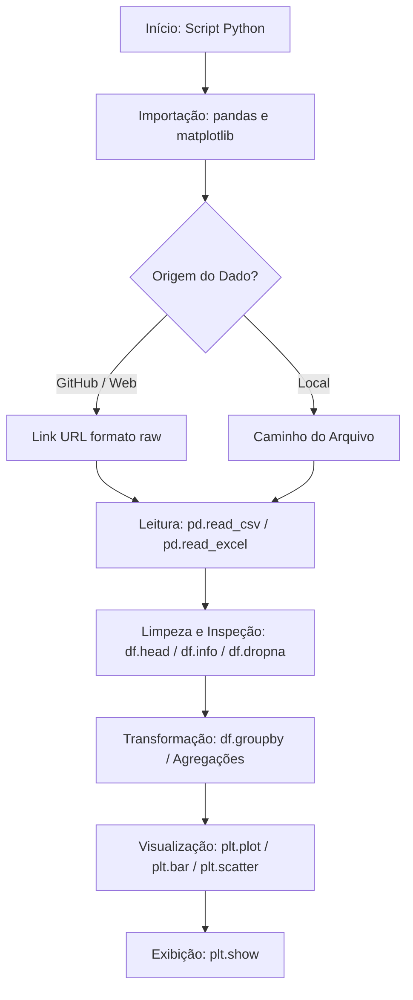
**Teoria:**
- **Pandas:** Biblioteca para manipulação de dados estruturados (DataFrames). A leitura via GitHub exige o link 'raw' para obter o conteúdo puro.
- **Matplotlib (Pyplot):** Interface para criação de gráficos em camadas (eixos, títulos, renderização).

---

### 2. Machine Learning - Predição (Scikit-Learn)
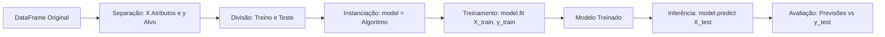
**Teoria:**
- **model.fit(X, y):** Etapa de treinamento onde o modelo aprende a relação entre atributos e alvos.
- **model.predict(X_novo):** Etapa de inferência onde o modelo estima resultados para dados não vistos.

---

### 3. Pipeline de Dados (Luigi Framework)
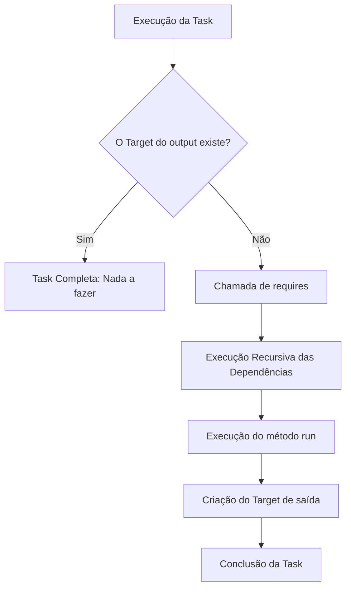
**Teoria:**
- **Idempotência:** No Luigi, se o arquivo de saída (Target) já existe, a tarefa é considerada concluída e não é reexecutada.

---

### 4. Computação em Nuvem: Modelos e Arquiteturas
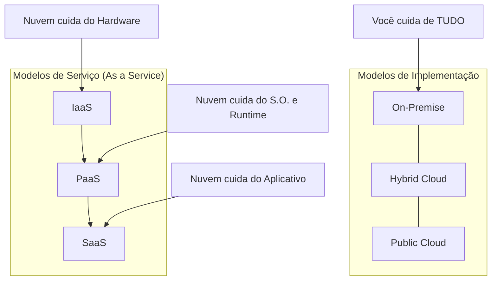

| Conceito | Analogia | Descrição Técnica |
| :--- | :--- | :--- |
| **On-Premise** | Cozinhar em Casa | Infraestrutura física local. Você é responsável pelo hardware, energia e software. |
| **IaaS** | Alugar a Cozinha | Infraestrutura como Serviço. Você aluga servidores virtuais (EC2) e instala o que desejar. |
| **PaaS** | Pedir um Kit de Cozinha | Plataforma como Serviço. O S.O. e o Python/SQL já estão prontos. Você foca no código. |
| **SaaS** | Comer no Restaurante | Software como Serviço. Aplicação pronta via browser (Office 365, Google Drive). |

---

### 5. Infraestrutura Global AWS
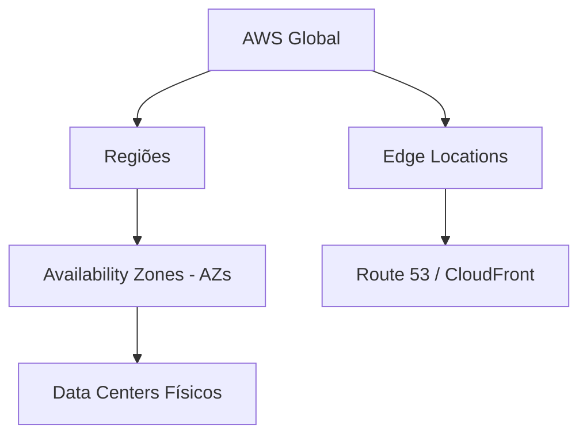

- **Regiões:** Localidades geográficas isoladas (ex: São Paulo).
- **AZs:** Conjuntos de Data Centers dentro de uma região. Para alta disponibilidade, use pelo menos duas AZs.
- **Edge Locations:** Pontos de presença para entrega de conteúdo com baixa latência (CDN).

---

# 🛠️ AWS: Gerenciamento, IaC e Computação Elástica

Este documento detalha as formas de interagir com a AWS e o ciclo de vida do serviço core de computação: EC2.

---

## 1. Interfaces de Interação e APIs (O Caminho do Comando)

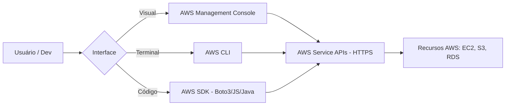

**Teoria:**
- **AWS Management Console:** Interface gráfica via navegador, ideal para aprendizado e tarefas visuais rápidas.
- **AWS CLI:** Interface de linha de comando que permite automação via scripts e terminal.
- **AWS SDK:** Bibliotecas de software (como o **Boto3** para Python) que permitem que o código interaja diretamente com os serviços AWS.
- **Importante:** Todas as interfaces acima enviam requisições **HTTPS** para as **APIs** dos serviços AWS. A API é o ponto único de entrada para todas as ações na nuvem.

---

## 2. Provisionamento e IaC (Infraestrutura como Código)

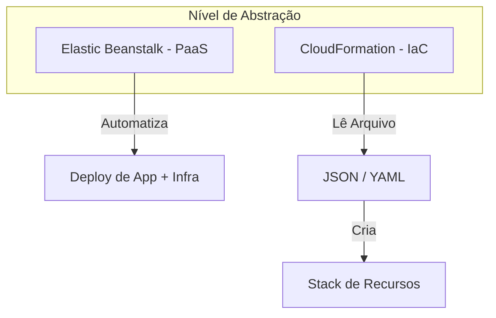

**Teoria:**
- **AWS CloudFormation:** É o serviço nativo de **Infraestrutura como Código (IaC)**. Você define todos os recursos (servidores, redes, bancos de dados) em um arquivo de texto (**YAML ou JSON**) chamado **Template**. Quando o CloudFormation lê esse template, ele cria uma **Stack** (conjunto) de recursos de forma automatizada e repetível.
- **AWS Elastic Beanstalk:** Um serviço de **PaaS** que facilita o deploy de aplicações. Ele automatiza o provisionamento de infraestrutura (EC2, Load Balancers, Auto Scaling) baseado apenas no upload do seu código.

---

## 3. Amazon EC2: Ciclo de Vida e Instâncias

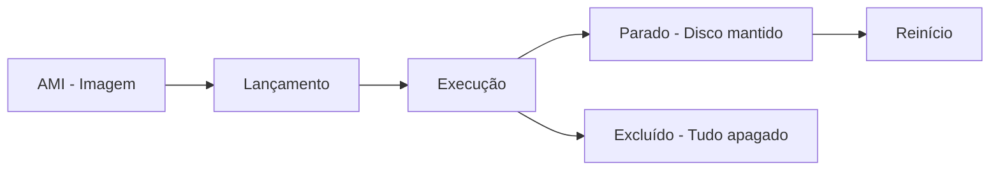

**Teoria:**
- **AMI (Amazon Machine Image):** É o "molde" ou imagem do sistema operacional (ex: Linux, Windows) que contém as configurações iniciais do servidor.
- **Ciclo de Vida:**
    - **Stop:** A instância para de rodar, mas o disco (**EBS**) continua armazenado. Você não paga pelo processamento, apenas pelo armazenamento do disco.
    - **Start:** Reinicia uma instância parada, mantendo os dados salvos no disco.
    - **Terminate:** A instância é excluída permanentemente. Por padrão, os volumes de disco associados também são deletados, e o ID da instância deixa de existir.

## 1. Elastic Load Balancing (ELB)

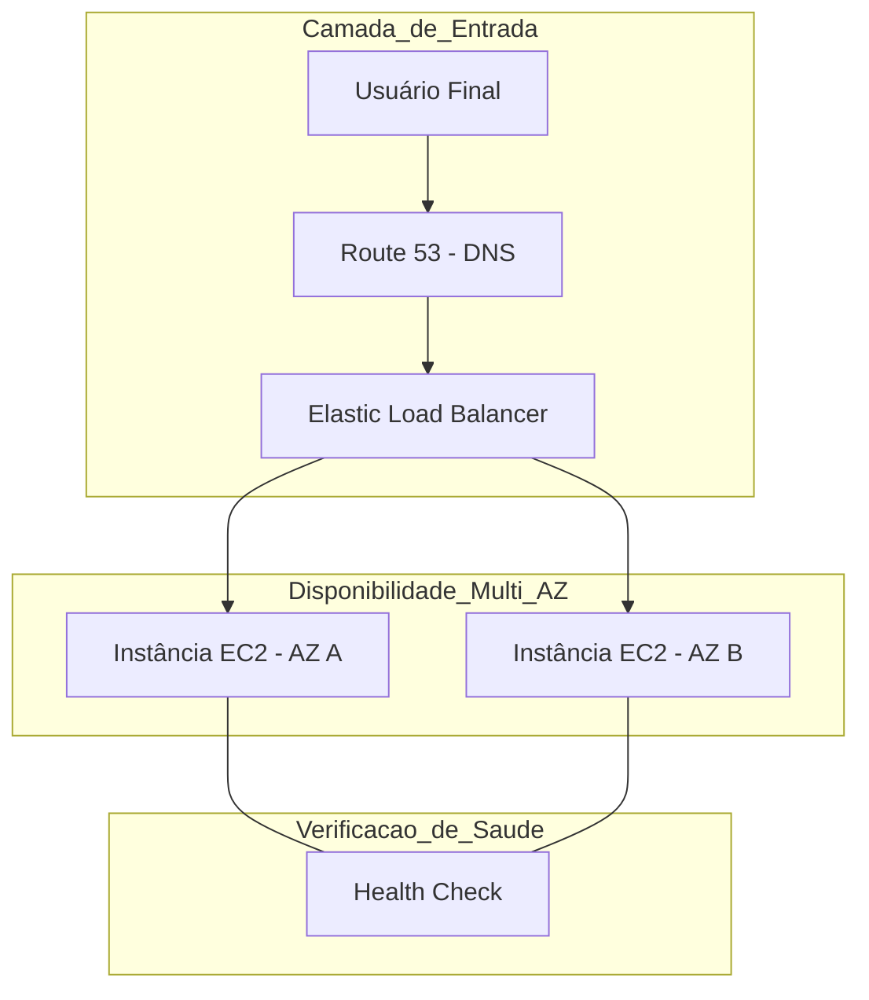
**Teoria:**
- **Elastic Load Balancing (ELB):** Distribuição de Tráfego: Distribui automaticamente o tráfego de entrada entre vários destinos, como instâncias EC2 e containers, em uma ou mais Availability Zones.
	- **Distribuição de Tráfego:** Distribui automaticamente o tráfego de entrada entre vários destinos, como instâncias EC2 e containers, em uma ou mais Availability Zones.
	- **Health Checks: ** Monitora a integridade dos alvos; se uma instância falha, o ELB interrompe o envio de tráfego para ela e o redireciona para instâncias saudáveis.
	- **Alta Disponibilidade:** Atua como o ponto único de contato, garantindo que o sistema suporte falhas de hardware ou de data centers isolados.
## 2. Mensageria: SQS e SNS
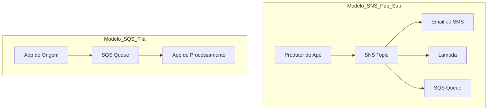
- **Teoria**
    - **Amazon SNS (Simple Notification Service)** Serviço de mensagens do tipo Publicação/Assinatura (Pub/Sub) para comunicação entre aplicações ou notificações.
    - **Modelo Pub/Sub** Sistema onde uma mensagem enviada a um tópico é entregue simultaneamente a todos os assinantes via Push-based.
    - **Amazon SQS (Simple Queue Service)** Serviço de filas de mensagens que permite o desacoplamento de microserviços e sistemas distribuídos.
    - **Modelo de Fila** Armazena mensagens até que sejam processadas; o consumidor busca as mensagens via Pull-based de forma assíncrona.
    - **Persistência** As mensagens ficam na fila até serem deletadas pelo consumidor, evitando perda de dados se o destino estiver offline.


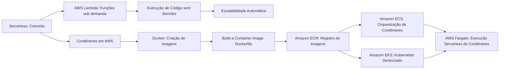

- **Teoria**
    - **Serverless** Modelo de computação em nuvem onde o provedor gerencia automaticamente a infraestrutura, permitindo que o desenvolvedor foque apenas no código sem se preocupar com servidores.
    - **AWS Lambda** Serviço serverless da AWS que executa funções em resposta a eventos, escalando automaticamente e cobrando apenas pelo tempo de execução.
    - **Contêineres em AWS** Tecnologia que empacota aplicações e suas dependências em unidades portáteis e consistentes, facilitando a execução em diferentes ambientes.
    - **Docker** Plataforma de software que permite criar, distribuir e executar contêineres de forma padronizada e eficiente.
    - **Build a Container Image** Processo de criação de uma imagem de contêiner a partir de um Dockerfile, contendo instruções para configurar o ambiente e a aplicação.
    - **Amazon ECR (Elastic Container Registry)** Serviço da AWS para armazenar, gerenciar e compartilhar imagens de contêiner de forma segura e escalável.
    - **Amazon ECS (Elastic Container Service)** Serviço de orquestração de contêineres que permite executar e gerenciar aplicações em contêineres na AWS.
    - **Amazon EKS (Elastic Kubernetes Service)** Serviço gerenciado da AWS que facilita a execução de clusters Kubernetes para orquestração avançada de contêineres.
    - **AWS Fargate** Tecnologia serverless para execução de contêineres sem necessidade de gerenciar servidores ou clusters, integrando-se ao ECS e EKS.

## 3. Amazon VPC e Conectividade

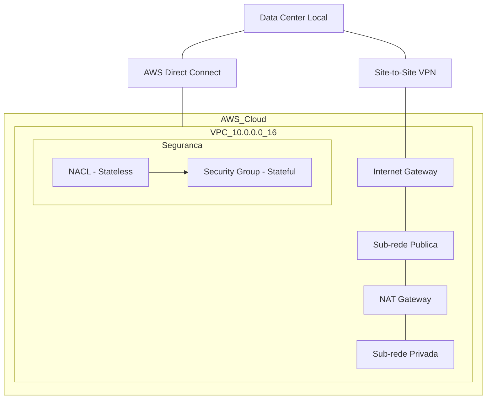
- **Teoria**
    - **Amazon VPC (Virtual Private Cloud)** Seção isolada logicamente da Nuvem AWS onde você define sua própria rede virtual, endereçamento IP e tabelas de roteamento.
    - **Sub-rede Pública** Possui rota direta para a Internet através de um Internet Gateway (IGW); usada para recursos que precisam ser acessados externamente (ex: Load Balancers).
    - **Sub-rede Privada** Não possui rota direta para a Internet; utiliza um NAT Gateway (na sub-rede pública) para que recursos internos baixem atualizações sem ficarem expostos.
    - **NACL (Network Access Control List)** Camada de segurança opcional que atua como um firewall para controlar o tráfego que entra e sai de uma sub-rede (Stateless).
    - **AWS Direct Connect** Serviço de rede que estabelece uma conexão dedicada e privada entre o seu Data Center local e a AWS, ignorando a internet pública para menor latência.
    - **Caso de Uso** Hospedar uma aplicação multicamadas, onde o servidor web fica na sub-rede pública e o banco de dados fica isolado na sub-rede privada.

## 4. Sub-redes e Controles de Acesso (AWS VPC)

```mermaid
graph TD
    A[VPC: Rede Virtual] --> B[Sub-rede Pública]
    A --> C[Sub-rede Privada]

    B --> D[Internet Gateway (IGW)]
    C --> E[NAT Gateway na Sub-rede Pública]

    B --> F[Recursos Externos: Servidor Web, Load Balancer]
    C --> G[Recursos Internos: Banco de Dados, Aplicações]

    A --> H[NACL: Controle de Tráfego (Stateless)]
    A --> I[Security Groups: Controle de Tráfego (Stateful)]

    J[Data Center Local] --> K[AWS Direct Connect]
    K --> A
```
- **Teoria**
    - **Amazon VPC (Virtual Private Cloud)** Seção isolada logicamente da Nuvem AWS onde você define sua própria rede virtual, endereçamento IP e tabelas de roteamento.
    - **Sub-rede Pública** Possui rota direta para a Internet através de um Internet Gateway (IGW); usada para recursos que precisam ser acessados externamente (ex: Load Balancers).
    - **Sub-rede Privada** Não possui rota direta para a Internet; utiliza um NAT Gateway (na sub-rede pública) para que recursos internos baixem atualizações sem ficarem expostos.
    - **NACL (Network Access Control List)** Camada de segurança opcional que atua como um firewall para controlar o tráfego que entra e sai de uma sub-rede (Stateless).
    - **Security Groups** Camada de segurança aplicada diretamente às instâncias e recursos, controlando tráfego de entrada e saída de forma stateful.
    - **AWS Direct Connect** Serviço de rede que estabelece uma conexão dedicada e privada entre o seu Data Center local e a AWS, ignorando a internet pública para menor latência.
    - **Caso de Uso** Hospedar uma aplicação multicamadas, onde o servidor web fica na sub-rede pública e o banco de dados fica isolado na sub-rede privada.
## 📦 Armazenamento de Arquivos e Objetos

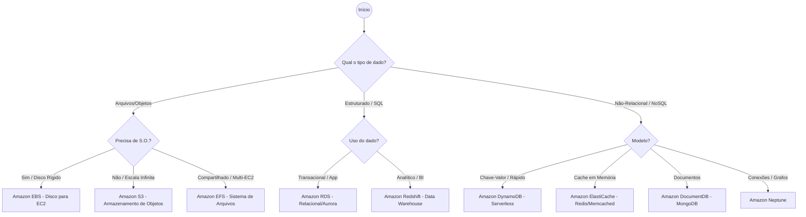

- **Teoria**
    - **Amazon S3 (Simple Storage Service)** Armazenamento de objetos (arquivos, imagens, vídeos) com escalabilidade praticamente infinita. Conceitos chave: Buckets (pastas raiz), alta durabilidade (99.999999999%) e diferentes classes de custo (Standard, Intelligent-Tiering, Glacier). Uso: Hospedagem de sites estáticos, backups e data lakes.
    - **Amazon EBS (Elastic Block Store)** Armazenamento em bloco de alto desempenho para instâncias EC2 (como um "HD" ou "SSD" virtual). Conceitos chave: Persistência (dados salvos após desligar a instância) e Snapshots (backups incrementais). Uso: Sistemas operacionais, bancos de dados instalados no EC2 e aplicações que exigem baixa latência.
    - **Amazon EFS (Elastic File System)** Sistema de arquivos gerenciado (NFS) que pode ser montado em várias instâncias EC2 simultaneamente. Conceitos chave: Escala automaticamente conforme adiciona arquivos; ideal para compartilhamento de dados entre servidores. Uso: Servidores web, diretórios de usuários e clusters de processamento.
    - **Amazon RDS (Relational Database Service)** Serviço gerenciado para bancos de dados relacionais (SQL). Motores: MySQL, PostgreSQL, MariaDB, Oracle, SQL Server e Amazon Aurora. Destaque: Automatiza backups, patches e alta disponibilidade (Multi-AZ).
    - **Amazon DynamoDB** Banco de dados não relacional (NoSQL) de chave-valor. Conceitos chave: Serverless, performance de milissegundos em qualquer escala e totalmente gerenciado. Uso: Aplicações móveis, carrinhos de compras e jogos.
    - **Amazon Redshift** Data Warehouse em escala de petabytes. Destaque: Armazenamento colunar e processamento paralelo massivo para análise de grandes volumes de dados. Uso: Relatórios complexos, análise de tendências de mercado e Big Data.
    - **Amazon ElastiCache** Banco em memória (Redis/Memcached). Uso: Cache de dados para acelerar aplicações.
    - **Amazon DocumentDB** Banco NoSQL orientado a documentos, compatível com MongoDB.
    - **Amazon Neptune** Banco de grafos. Uso: Redes sociais, detecção de fraudes e relacionamentos complexos.
    - **Amazon Timestream** Banco de séries temporais. Uso: Dados de IoT e monitoramento de métricas ao longo do tempo.

## 🛠️ Fluxograma: Ciclo de Vida do Dado na AWS

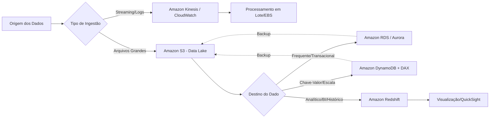

- **Teoria**
    - **Armazenamento de Blocos (EBS)** É como um "pendrive" ou "HD" virtual. Precisa estar anexado a uma instância EC2. Se a instância morrer e o volume não for persistente, os dados somem. Suporta Snapshots (backups incrementais).
    - **Armazenamento de Objetos (S3)** É como um "Google Drive" infinito. Acessível via URL/API. Durabilidade de 11 noves (99,999999999%). Ideal para Data Lakes e armazenamento massivo.
    - **Banco de Dados Relacional (RDS/Aurora)** Estruturado, suporta SQL e JOINs. Usado em aplicações tradicionais como ERPs e e-commerce. Aurora é otimizado com replicação em 3 AZs e alta performance.
    - **Banco de Dados NoSQL (DynamoDB)** Chave-valor, suporta JSON, escala global com latência de milissegundos. Ideal para aplicações com milhões de usuários e necessidade de alta velocidade.
    - **Cache DAX** Cache exclusivo para DynamoDB, reduz consultas para microssegundos.
    - **ElastiCache** Cache genérico em memória (Redis/Memcached), acelera RDS e sessões de usuários.
    - **Classes de Armazenamento S3** 
        - **Standard** Para acesso frequente.  
        - **Intelligent-Tiering** Quando não se sabe o padrão de acesso, ajusta automaticamente para economizar.  
        - **Glacier** Para arquivos raramente acessados, recuperação em horas ou dias, custo mais baixo.
    - **Checklist de Revisão**
        - **EFS** Compartilha arquivos entre várias instâncias Linux simultaneamente.  
        - **Redshift** Usado para BI (OLAP), não para transações OLTP.  
        - **EBS st1 (HDD)** Focado em throughput (logs).  
        - **EBS io2/gp3 (SSD)** Focado em IOPS (bancos de dados).
