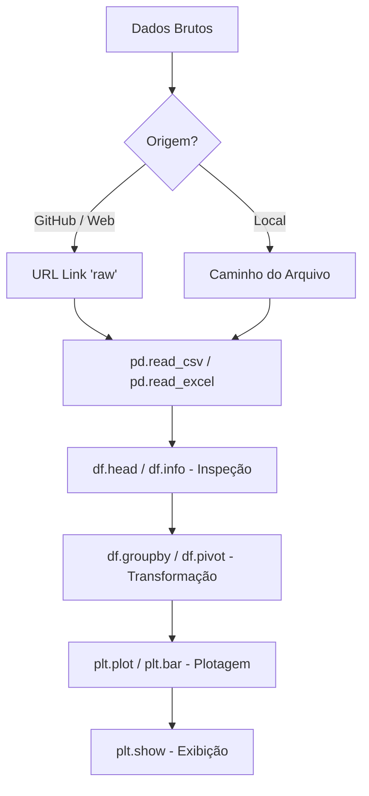
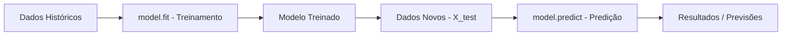
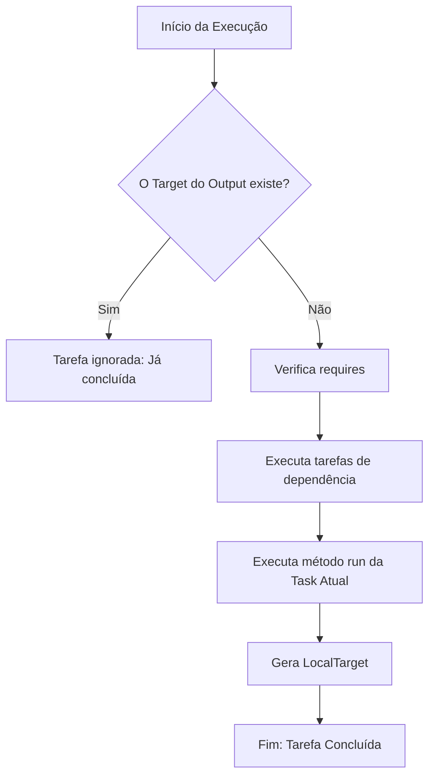

# Fluxogramas e Teoria do Projeto de Vendas

### 1. Manipulação e Visualização (Pandas & Matplotlib)

**Teoria:**
- **Pandas:** É uma biblioteca para manipulação e análise de dados estruturados. O objeto principal é o `DataFrame` (tabela bidimensional). A leitura de dados via URL (GitHub) requer o link no formato 'raw' para que o interpretador receba o conteúdo textual puro do arquivo.
- **Matplotlib (Pyplot):** É uma interface de plotagem que permite criar gráficos de forma sequencial. O comando `plt.plot()` define os eixos e o tipo de gráfico, enquanto `plt.show()` renderiza o resultado final na tela.

---

### 2. Machine Learning - Predição (Scikit-Learn)

**Teoria:**
- **model.fit(X, y):** Este método executa o treinamento do algoritmo. O parâmetro `X` representa a matriz de características (atributos) e `y` o vetor de alvos (o que se deseja prever). O modelo busca padrões matemáticos que correlacionam `X` com `y`.
- **model.predict(X_novo):** Após o treinamento, o modelo utiliza os padrões aprendidos para estimar resultados em dados que ele ainda não viu. É a etapa de inferência estatística.

---

### 3. Pipeline de Dados (Luigi Framework)

**Teoria:**
- **Task:** A unidade básica de trabalho no Luigi. Cada tarefa deve ser atômica e específica.
- **requires():** Define o grafo de dependências. Uma tarefa só executa se todas as suas dependências estiverem concluídas.
- **output() / Target:** O Luigi é baseado em "Targets" (alvos). Se o arquivo definido no `output()` (geralmente um `LocalTarget`) já existir no disco, o Luigi entende que a tarefa já foi realizada e não a executa novamente, garantindo a eficiência do pipeline (idempotência).
- **run():** Contém a lógica de processamento dos dados.
