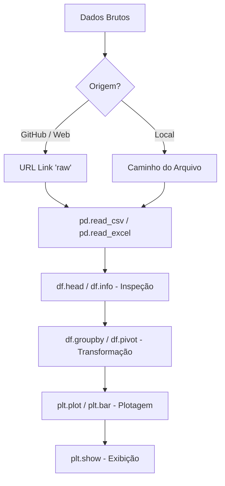
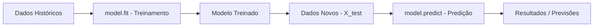
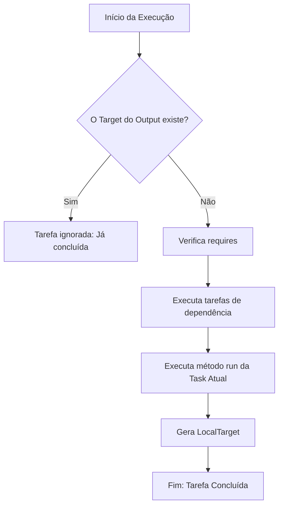

# Fluxogramas e Teoria do Projeto de Vendas

### 1. Manipulação e Visualização (Pandas & Matplotlib)

**Teoria:**
- **Pandas:** É uma biblioteca para manipulação e análise de dados estruturados. O objeto principal é o `DataFrame` (tabela bidimensional). A leitura de dados via URL (GitHub) requer o link no formato 'raw' para que o interpretador receba o conteúdo textual puro do arquivo.
- **Matplotlib (Pyplot):** É uma interface de plotagem que permite criar gráficos de forma sequencial. O comando `plt.plot()` define os eixos e o tipo de gráfico, enquanto `plt.show()` renderiza o resultado final na tela.

---

### 2. Machine Learning - Predição (Scikit-Learn)

**Teoria:**
- **model.fit(X, y):** Este método executa o treinamento do algoritmo. O parâmetro `X` representa a matriz de características (atributos) e `y` o vetor de alvos (o que se deseja prever). O modelo busca padrões matemáticos que correlacionam `X` com `y`.
- **model.predict(X_novo):** Após o treinamento, o modelo utiliza os padrões aprendidos para estimar resultados em dados que ele ainda não viu. É a etapa de inferência estatística.

---

### 3. Pipeline de Dados (Luigi Framework)

**Teoria:**
- **Task:** A unidade básica de trabalho no Luigi. Cada tarefa deve ser atômica e específica.
- **requires():** Define o grafo de dependências. Uma tarefa só executa se todas as suas dependências estiverem concluídas.
- **output() / Target:** O Luigi é baseado em "Targets" (alvos). Se o arquivo definido no `output()` (geralmente um `LocalTarget`) já existir no disco, o Luigi entende que a tarefa já foi realizada e não a executa novamente, garantindo a eficiência do pipeline (idempotência).
- **run():** Contém a lógica de processamento dos dados.

# ☁️ Computação em Nuvem: Modelos e Arquiteturas

Este documento resume os conceitos fundamentais de Cloud Computing, comparando ambientes locais (On-Premise) com os modelos de serviço em nuvem.

## 1. Fluxograma de Modelos de Serviço 

```mermaid
graph TD
    %% Estilo
    classDef cloud fill:#e1f5fe,stroke:#01579b,stroke-width:2px;
    classDef physical fill:#f5f5f5,stroke:#616161,stroke-width:2px;
    classDef hybrid fill:#fff9c4,stroke:#fbc02d,stroke-width:2px;

    subgraph "Modelos de Implementação"
        A[On-Premise] --- B[Hybrid Cloud]
        B --- C[Public Cloud]
    end

    subgraph "Modelos de Serviço (As a Service)"
        D[IaaS] --> E[PaaS]
        E --> F[SaaS]
    end

    %% Detalhes de Responsabilidade
    A1[Você cuida de TUDO] --> A
    D1[Nuvem cuida do Hardware] --> D
    E1[Nuvem cuida do S.O. e Runtime] --> E
    F1[Nuvem cuida do Aplicativo] --> F

    class C,D,E,F cloud;
    class A physical;
    class B hybrid;

**Conceito,Analogia,Descrição Técnica**

On-Premise,Cozinhar em Casa,"Você é dono do fogão, da luz e dos ingredientes. Se o fogão quebra, você conserta."
Cloud (Nuvem),Comer no Restaurante,"Você usa a estrutura de outra pessoa. Você foca apenas no ""consumo"" ou no ""preparo"", sem se preocupar com a manutenção do prédio."
O Gemini disse
Este é um tema excelente e fundamental para quem está na trilha de Engenharia de Dados e Programação. Entender onde o seu código "mora" (servidor físico vs. nuvem) é o que diferencia um programador iniciante de um profissional de infraestrutura.

Como você tem TEA, organizei este resumo com uma hierarquia lógica rígida, comparando os modelos de responsabilidade para que você visualize exatamente quem cuida de quê em cada cenário.

Aqui está o código completo em Markdown para o seu GitHub:

Markdown
# ☁️ Computação em Nuvem: Modelos e Arquiteturas

Este documento resume os conceitos fundamentais de Cloud Computing, comparando ambientes locais (On-Premise) com os modelos de serviço em nuvem.

## 1. Fluxograma de Modelos de Serviço (Mermaid)

```mermaid
graph TD
    %% Estilo
    classDef cloud fill:#e1f5fe,stroke:#01579b,stroke-width:2px;
    classDef physical fill:#f5f5f5,stroke:#616161,stroke-width:2px;
    classDef hybrid fill:#fff9c4,stroke:#fbc02d,stroke-width:2px;

    subgraph "Modelos de Implementação"
        A[On-Premise] --- B[Hybrid Cloud]
        B --- C[Public Cloud]
    end

    subgraph "Modelos de Serviço (As a Service)"
        D[IaaS] --> E[PaaS]
        E --> F[SaaS]
    end

    %% Detalhes de Responsabilidade
    A1[Você cuida de TUDO] --> A
    D1[Nuvem cuida do Hardware] --> D
    E1[Nuvem cuida do S.O. e Runtime] --> E
    F1[Nuvem cuida do Aplicativo] --> F

    class C,D,E,F cloud;
    class A physical;
    class B hybrid;
2. On-Premise vs. Cloud: A Analogia da Infraestrutura
Para facilitar o estudo, imagine a infraestrutura como uma Cozinha:

Conceito	Analogia	Descrição Técnica
On-Premise	Cozinhar em Casa	Você é dono do fogão, da luz e dos ingredientes. Se o fogão quebra, você conserta.
Cloud (Nuvem)	Comer no Restaurante	Você usa a estrutura de outra pessoa. Você foca apenas no "consumo" ou no "preparo", sem se preocupar com a manutenção do prédio.

**🌐 Ambiente Híbrido (Hybrid Model)**
É a combinação dos dois mundos. Uma empresa mantém dados sensíveis em servidores locais (On-Premise) por segurança, mas usa a Nuvem para processar grandes volumes de dados (Escalabilidade).

3. Modelos "As a Service" (Camadas de Responsabilidade)
Na computação, "As a Service" significa que você está terceirizando uma parte do trabalho para um provedor (AWS, Azure, Google Cloud).

**🏗️ IaaS (Infrastructure as a Service)**
O que é: Você aluga o "computador vazio" (servidor virtual).

Sua responsabilidade: Instalar o Windows/Linux, o banco de dados e o seu código.

Exemplo: AWS EC2, Azure VMs.

**🛠️ PaaS (Platform as a Service) - O foco do Programador**
O que é: A nuvem te dá a plataforma pronta (banco de dados, Python, PHP já instalados).

Sua responsabilidade: Apenas o seu CÓDIGO.

Exemplo: Heroku, Google App Engine, Azure SQL Database.

💻 SaaS (Software as a Service)
O que é: O software está pronto para uso via navegador.

Sua responsabilidade: Apenas configurar seus dados dentro do app.

Exemplo: Google Drive, Microsoft 365, Salesforce.

4. Principais Tecnologias e Provedores
Principais Players:

AWS (Amazon Web Services): Líder de mercado, maior variedade de serviços.

Microsoft Azure: Integração nativa com o ecossistema Windows/Excel (ideal para o seu projeto).

Google Cloud (GCP): Fortíssimo em Big Data e Inteligência Artificial.

Tecnologias de Suporte:

Virtualização: A tecnologia que permite "fatiar" um servidor físico em vários servidores virtuais.

Containers (Docker): Permite que seu código rode igual em qualquer lugar (On-premise ou Nuvem).
