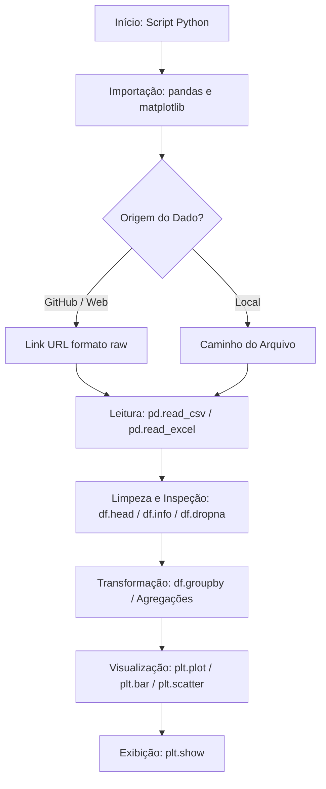
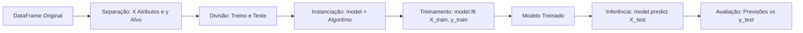
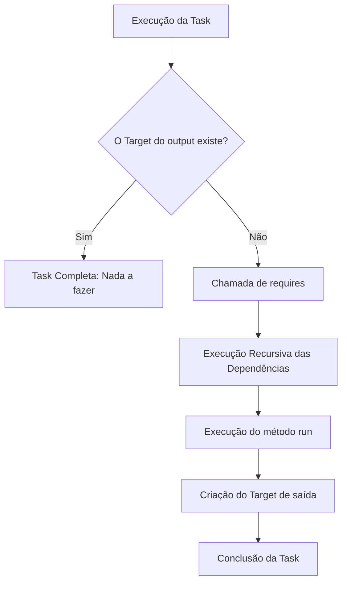
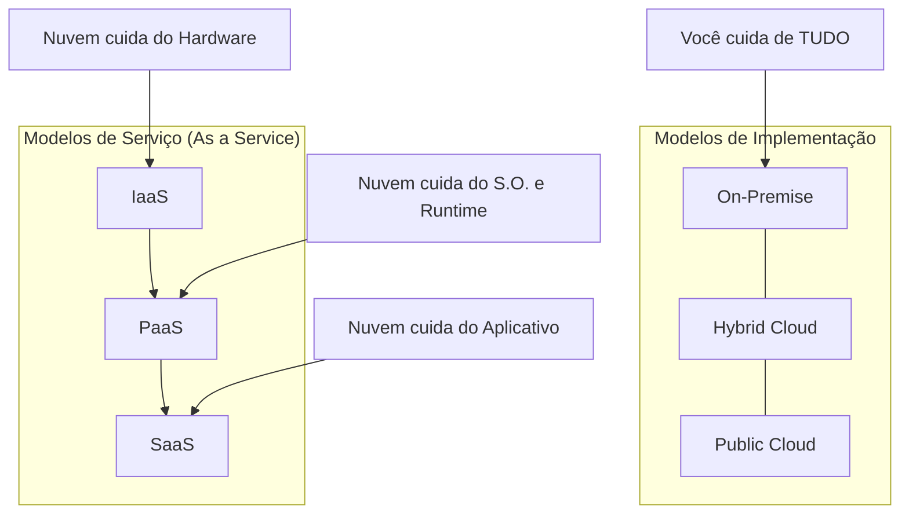
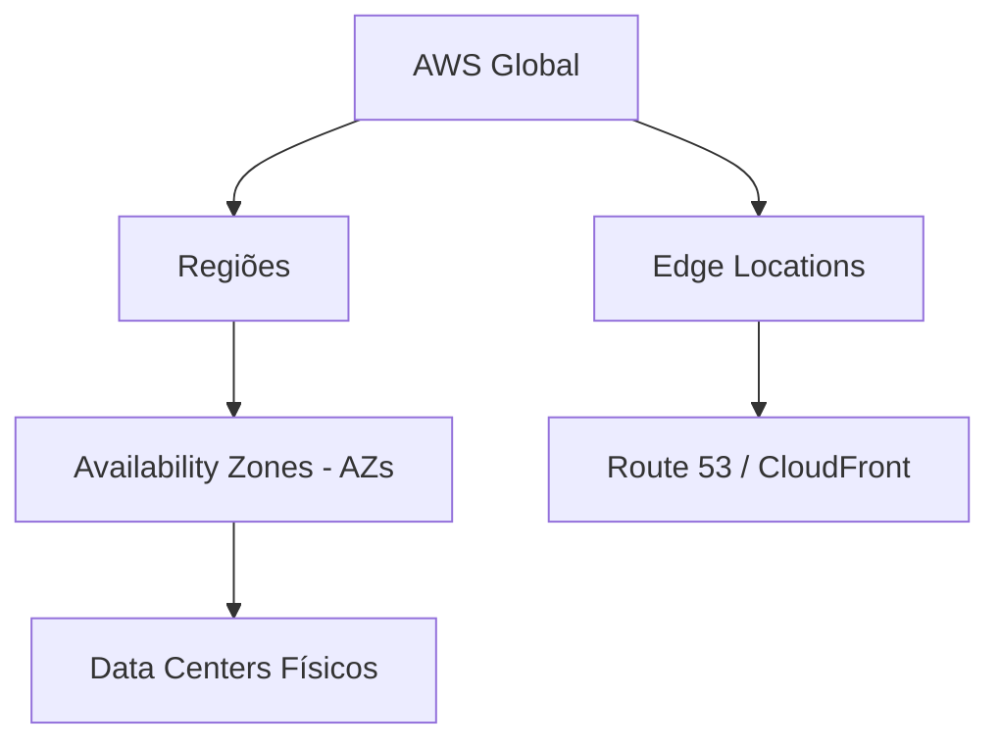

# Fluxogramas e Teoria: Ciência de Dados e Nuvem

Este documento detalha os fluxos lógicos e a base teórica para manipulação de dados, aprendizado de máquina e infraestrutura em nuvem.

---

### 1. Manipulação e Visualização (Pandas & Matplotlib)

**Teoria:**
- **Pandas:** Biblioteca para manipulação de dados estruturados (DataFrames). A leitura via GitHub exige o link 'raw' para obter o conteúdo puro.
- **Matplotlib (Pyplot):** Interface para criação de gráficos em camadas (eixos, títulos, renderização).

---

### 2. Machine Learning - Predição (Scikit-Learn)

**Teoria:**
- **model.fit(X, y):** Etapa de treinamento onde o modelo aprende a relação entre atributos e alvos.
- **model.predict(X_novo):** Etapa de inferência onde o modelo estima resultados para dados não vistos.

---

### 3. Pipeline de Dados (Luigi Framework)

**Teoria:**
- **Idempotência:** No Luigi, se o arquivo de saída (Target) já existe, a tarefa é considerada concluída e não é reexecutada.

---

### 4. Computação em Nuvem: Modelos e Arquiteturas

| Conceito | Analogia | Descrição Técnica |
| :--- | :--- | :--- |
| **On-Premise** | Cozinhar em Casa | Infraestrutura física local. Você é responsável pelo hardware, energia e software. |
| **IaaS** | Alugar a Cozinha | Infraestrutura como Serviço. Você aluga servidores virtuais (EC2) e instala o que desejar. |
| **PaaS** | Pedir um Kit de Cozinha | Plataforma como Serviço. O S.O. e o Python/SQL já estão prontos. Você foca no código. |
| **SaaS** | Comer no Restaurante | Software como Serviço. Aplicação pronta via browser (Office 365, Google Drive). |

---

### 5. Infraestrutura Global AWS

- **Regiões:** Localidades geográficas isoladas (ex: São Paulo).
- **AZs:** Conjuntos de Data Centers dentro de uma região. Para alta disponibilidade, use pelo menos duas AZs.
- **Edge Locations:** Pontos de presença para entrega de conteúdo com baixa latência (CDN).
