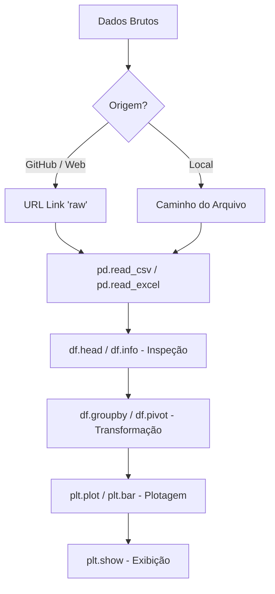
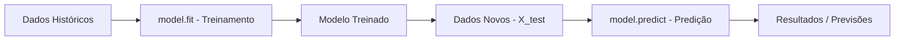
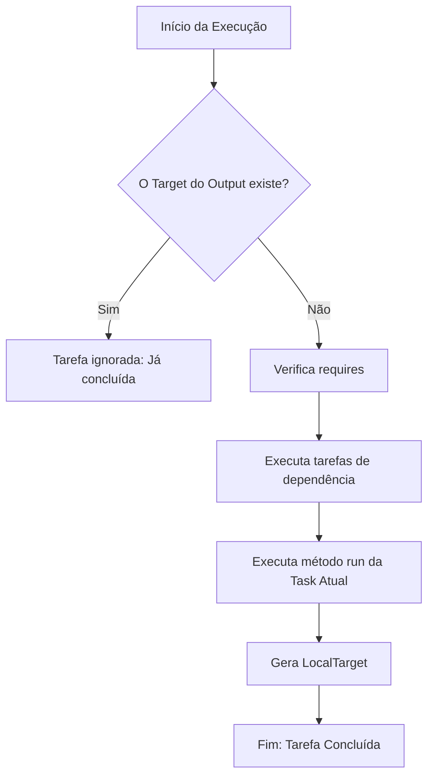

# Fluxogramas do Projeto de Vendas

### 1. Manipulação e Visualização (Pandas & Matplotlib)

```mermaid
graph TD
    A[Dados Brutos] --> B{Origem?}
    B -->|GitHub / Web| C[URL Link 'raw']
    B -->|Local| D[Caminho do Arquivo]
    C --> E[pd.read_csv / pd.read_excel]
    D --> E
    E --> F[df.head / df.info - Inspeção]
    F --> G[df.groupby / df.pivot - Transformação]
    G --> H[plt.plot / plt.bar - Plotagem]
    H --> I[plt.show - Exibição]
```

### 2. Machine Learning - Predição (Scikit-Learn)

```mermaid
graph LR
    A[Dados Históricos] --> B[model.fit - Treinamento]
    B --> C[Modelo Treinado]
    C --> D[Dados Novos - X_test]
    D --> E[model.predict - Predição]
    E --> F[Resultados / Previsões]
```

### 3. Pipeline de Dados (Luigi Framework)

```mermaid
graph TD
    Start[Início da Execução] --> CheckOutput{O Target do Output existe?}
    CheckOutput -- Sim --> TaskDone[Tarefa ignorada: Já concluída]
    CheckOutput -- Não --> CheckDeps[Verifica requires]
    CheckDeps --> RunDeps[Executa tarefas de dependência]
    RunDeps --> RunTask[Executa método run da Task Atual]
    RunTask --> CreateTarget[Gera LocalTarget]
    CreateTarget --> End[Fim: Tarefa Concluída]
```
