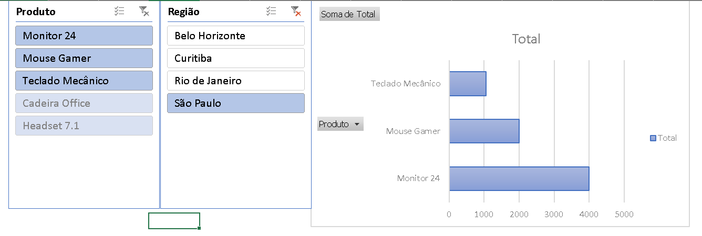

# 📊 Dashboard de Vendas Interativo - Projeto ETL

> **Figura 1:** Interface interativa finalizada. O painel apresenta a distribuição de faturamento por categoria de produto e por região geográfica, permitindo filtros em tempo real através dos Segmentadores de Dados (Slicers).

## 📝 Descrição
Este projeto faz parte de um desafio de Business Intelligence, onde transformamos dados brutos de um sistema legado em um dashboard executivo interativo utilizando Microsoft Excel e conceitos de ETL (Extract, Transform, Load).

## 🛠️ Tecnologias e Ferramentas
* **Microsoft Excel:** Construção da interface e visualização.
* **Power Query:** Limpeza e padronização dos dados (ETL).
* **Tabelas Dinâmicas:** Processamento e agregação de KPIs.
* **Segmentadores de Dados (Slicers):** Interatividade em tempo real.

## 🚀 Funcionalidades
* **Processamento de Dados:** Limpeza de strings e padronização de valores.
* **Visão por Produto:** Gráfico de barras dinâmico para análise de faturamento por item.
* **Visão Regional:** Gráfico de rosca para identificação de market share por região.
* **Filtros Inteligentes:** Navegação interativa entre produtos e localizações.

## 📂 Como utilizar
1. Baixe o arquivo `.xlsx` presente neste repositório.
2. Abra no Excel e clique em "Habilitar Edição".
3. Utilize os painéis laterais para filtrar os dados e observar a atualização automática dos gráficos.
