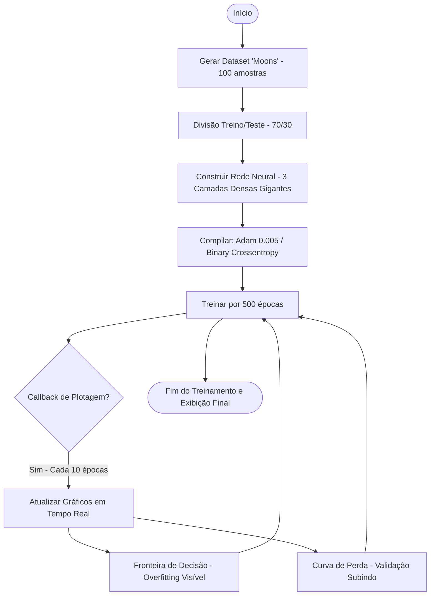
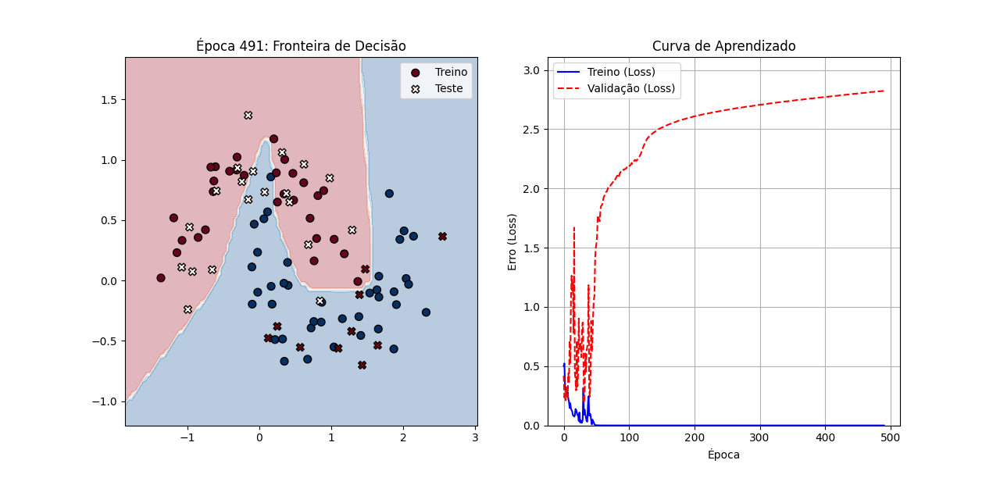
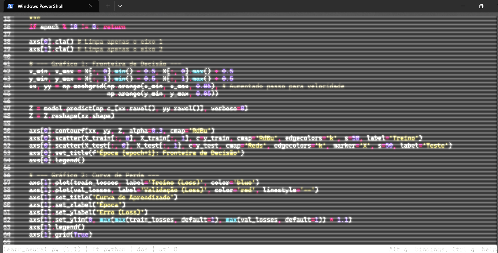

# 🧠 Visualização de Redes Neurais e Overfitting

Este projeto demonstra visualmente o fenômeno de **Overfitting** (sobreajuste) em redes neurais artificiais, utilizando a biblioteca TensorFlow/Keras e Matplotlib para renderização em tempo real.

## 🚀 O Processo
O script `learn_neural.py` foi projetado para forçar uma rede neural a "decorar" os dados de treino em vez de aprender o padrão geral. Isso é feito através de:
1. **Dataset Pequeno:** Apenas 100 amostras do problema "Moons".
2. **Rede Superdimensionada:** Mais de 2.500 neurônios em camadas densas para um problema simples de 2 dimensões.
3. **Treinamento Agressivo:** 500 épocas sem técnicas de regularização (como Dropout).

### 📊 Fluxograma de Execução


## 🖼️ Resultados Visuais

### 1. Fronteira de Decisão (Decision Boundary)

> **Figura 1:** Observe como a rede cria curvas extremamente complexas para tentar cercar cada ponto azul de treino. Isso mostra a rede "decorando" o ruído do dataset.

### 2. Curva de Aprendizado (Loss Curve)

> **Figura 2:** O gráfico de perda mostra o erro de treino (azul) caindo continuamente, enquanto o erro de validação (vermelho) começa a subir após algumas épocas. Este "descolamento" é o sinal clássico de Overfitting.

## 🛠️ Tecnologias Utilizadas
- **Python 3.x**
- **TensorFlow/Keras:** Construção e treinamento da rede.
- **Scikit-Learn:** Geração de dados sintéticos e pré-processamento.
- **Matplotlib:** Visualização interativa e geração de gráficos.

## 📝 Como Executar
1. Certifique-se de ter as dependências instaladas:
   ```bash
   pip install tensorflow numpy matplotlib scikit-learn
   ```
2. Execute o script:
   ```bash
   python learn_neural.py
   ```
3. Acompanhe a evolução dos gráficos em tempo real na janela que será aberta.
