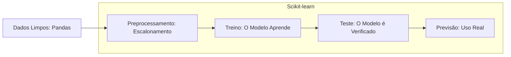

# Estudos de Machine Learning: Scikit-learn (sklearn)

O Scikit-learn é a biblioteca de Python para criar modelos estatísticos e preditivos a partir de dados estruturados.

## 01. O Fluxo de Trabalho (Workflow)

## 02. Principais Conceitos (Definição Literal)

| Conceito | O que é (Literal) | Exemplo Prático |
| :--- | :--- | :--- |
| **Regressão** | Prever um valor numérico contínuo. | Prever o valor de um imóvel (R$). |
| **Classificação** | Prever uma categoria (Classe). | Prever se um e-mail é Spam ou não. |
| **Agrupamento** | Reunir dados similares sem rótulos. | Agrupar clientes por hábito de compra. |

## 03. Comandos Essenciais (O Martelo)

*   **`model.fit(X, y)`**: O comando de **Treino**. O modelo recebe os dados (`X`) e as respostas (`y`) para aprender a relação entre eles.
*   **`model.predict(X_novo)`**: O comando de **Previsão**. O modelo usa o que aprendeu para dar uma resposta sobre dados que nunca viu.
*   **`train_test_split()`**: Divide o conjunto de dados em dois (uma parte para o modelo estudar e outra para provar que ele realmente aprendeu).

### Limites Técnicos:
1. **Dados Limpos:** O Scikit-learn não aceita nomes ou categorias em formato de texto. Tudo deve ser transformado em números antes do treino.
2. **Escalabilidade:** Ele é muito rápido para milhões de linhas, mas não é projetado para lidar com "Big Data" de centenas de TeraBytes (para isso usa-se o Spark).

---
