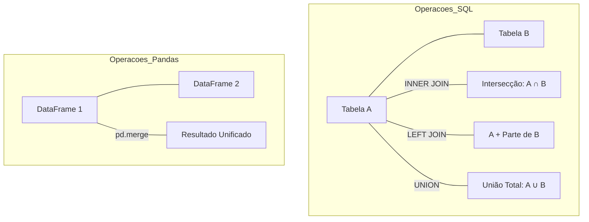

# Integração: Teoria dos Conjuntos (SQL e Pandas)

O SQL e o Pandas são baseados em operações matemáticas entre conjuntos de dados. Entender um ajuda a dominar o outro.

## 01. Operações de Conjunto

### Glossário Técnico de Conjuntos:

1.  **Intersecção (INNER JOIN):** Retorna apenas o que as duas fontes têm em comum. No Pandas: `pd.merge(how='inner')`.
2.  **Diferença (LEFT JOIN com Filtro):** Retorna o que existe em A mas não existe em B. No Pandas: `pd.merge(how='left')`.
3.  **União (UNION):** Combina dois conjuntos verticalmente. No Pandas: `pd.concat()`.

---
