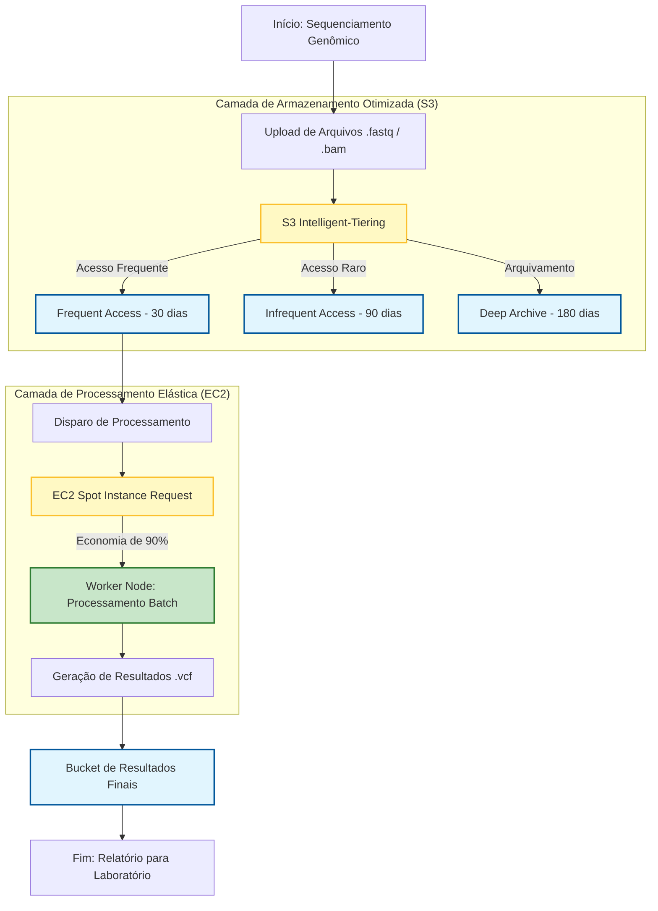

# 📊 Fluxograma de Arquitetura: Abstergo Cloud

Este documento apresenta o fluxo de processamento de dados genômicos da Abstergo Farmacêutica, destacando a integração entre armazenamento inteligente e computação de baixo custo.

---

## 1. Representação Visual (Mermaid)

---

## 2. Base Teórica do Fluxo

### A. Camada de Armazenamento (S3 Intelligent-Tiering)
O fluxo inicia com o upload de grandes volumes de dados brutos (`.fastq`). O uso do **Intelligent-Tiering** é crucial pois:
- **Automação:** Move os dados entre camadas de acesso frequente e raro sem necessidade de intervenção manual.
- **Custo:** Garante que dados de pesquisas antigas não gerem custos elevados, movendo-os para o *Deep Archive* automaticamente após 180 dias.

### B. Camada de Processamento (EC2 Spot Instances)
O processamento genômico é uma carga de trabalho do tipo **Batch** (em lote). 
- **Instâncias Spot:** São ideais aqui porque permitem utilizar o excesso de capacidade da AWS com descontos de até 90%. 
- **Resiliência:** O fluxo prevê que, se uma instância for interrompida, o processo pode ser reiniciado a partir do último checkpoint (arquivos no S3), mantendo a eficiência financeira.

### C. Resultados e Entrega
Os arquivos resultantes (`.vcf` - Variant Call Format) são armazenados em um bucket final para análise dos cientistas, garantindo que o dado processado esteja sempre disponível para a tomada de decisão clínica.
