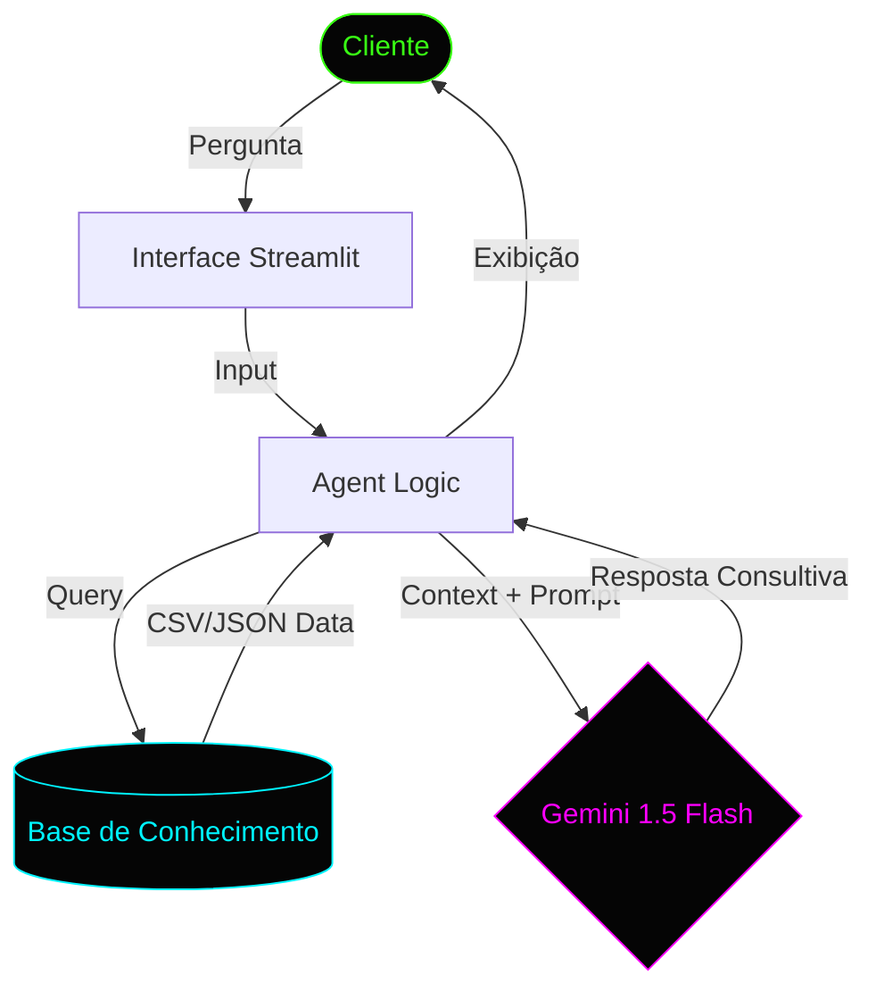

# 💰 Agente Financeiro Inteligente (AI-Driven Fintech Agent)

## 📺 Demonstração em Vídeo
**[Assista à apresentação completa no Google Drive](https://drive.google.com/file/d/1E9qqOjTmmU1TdfgXKdx44sWbXE6w3ETM/view?usp=drive_link)**
*O vídeo demonstra o fluxo completo de interação, desde a análise de gastos até a recomendação de investimentos.*

---

## 📝 Apresentação do Projeto
O **Agente Financeiro Inteligente** é uma solução de consultoria financeira automatizada que utiliza Inteligência Artificial Generativa para transformar dados brutos em insights acionáveis. Através da arquitetura **RAG (Retrieval-Augmented Generation)**, o agente processa históricos de transações, perfis de investidor e metas financeiras para fornecer conselhos personalizados, seguros e livres de alucinações.

### Diferenciais:
- **Integração Gemini:** Utiliza os modelos mais recentes (1.5, 2.0 e 2.5 Flash/Pro) para processamento de linguagem natural.
- **Análise Contextual:** Diferente de chatbots genéricos, ele "lê" seus dados financeiros (CSV/JSON) antes de responder.
- **Segurança de Dados:** Processamento local de arquivos e integração via API segura.
- **Resiliência:** Sistema preparado para falhas de rede e limites de cota de API.

---

## ⚙️ Fluxo de Operação (RAG Architecture)


---

## 🛠️ Funcionalidades
- **Análise de Gastos:** Identificação automática de categorias de despesas.
- **Sugestão de Investimentos:** Recomendações baseadas no perfil de risco do usuário.
- **Resiliência de Dados (Modo Demo):** Persistência de estado para demonstrações ininterruptas.
- **Interface Dinâmica:** Seleção de modelos e monitoramento de cota de API em tempo real.
- **Suporte Multi-formato:** Leitura robusta de arquivos CSV e JSON (incluindo suporte a BOM no Windows).

---

## 🚀 Instruções de Uso

### 1. Pré-requisitos
Certifique-se de ter o Python instalado e as bibliotecas necessárias:
```bash
pip install streamlit google-generativeai pandas
```

### 2. Configuração
1. Navegue até a pasta do projeto: `cd dev-log/projetos/agente_financeiro`
2. Obtenha uma chave de API em [Google AI Studio](https://aistudio.google.com/).

### 3. Execução
Execute o comando:
```bash
streamlit run app.py
```

### 4. Interação
1. No menu lateral, insira sua **Gemini API Key**.
2. Selecione o modelo (recomendado: `gemini-1.5-flash` ou `gemini-2.0-flash`).
3. O agente carregará automaticamente os dados de exemplo em `data/`.
4. Digite perguntas como: *"Como foram meus gastos no último mês?"* ou *"Qual investimento combina com meu perfil?"*

---

## 📂 Estrutura do Projeto
- `data/`: Contém arquivos de exemplo (`transactions.csv`, `profile.json`).
- `src/`: Lógica central do agente e tratamento de dados.
- `app.py`: Interface de usuário construída com Streamlit.

---
*Status do Sistema:* 🟢 **Operacional** | **Versão: 2.1 (Resiliência Ativa)**
