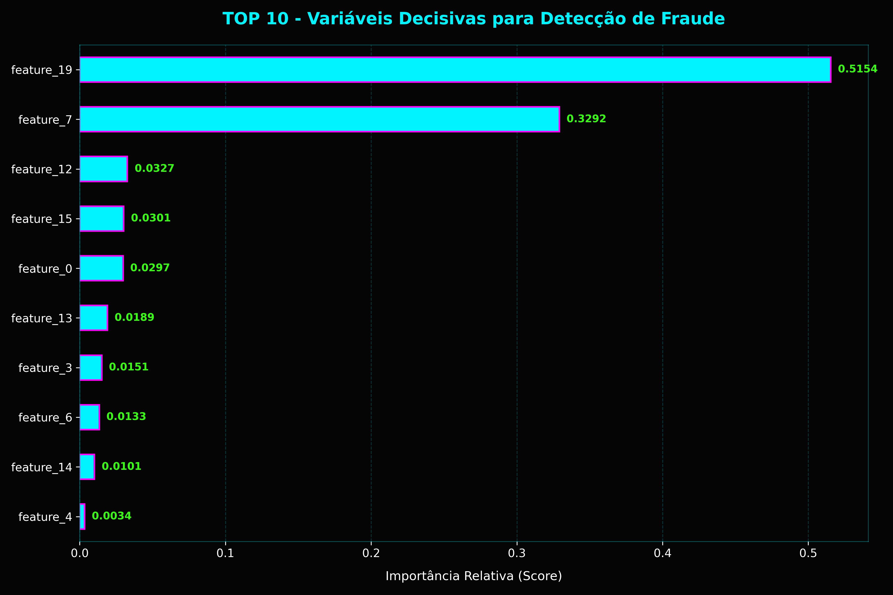
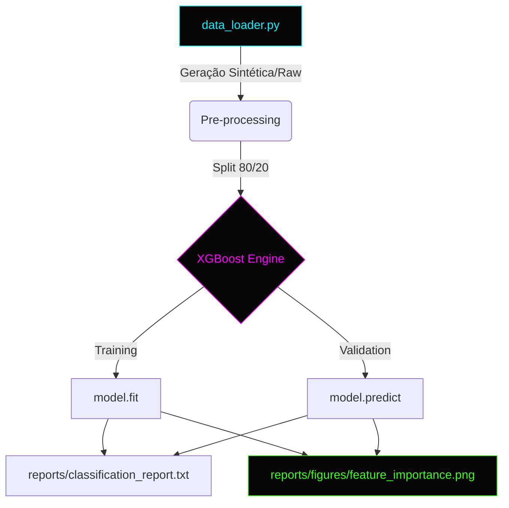

# 🛡️ Fraud Detection System (Fintech Solution)

Sistema de Monitoramento e Inteligência para Detecção de Fraudes Financeiras.

## 📂 Descrição Técnica
Este projeto implementa um motor de IA para detecção de fraudes utilizando o algoritmo **XGBoost**. O sistema foca em cenários de **alta desbalanceamento de classes** (onde fraudes representam < 1% das transações), priorizando precisão e explicabilidade dos resultados.

---

### 📊 Análise de Importância das Variáveis (HUD Output)

> **Insight:** O gráfico acima identifica os 10 principais fatores que o modelo utiliza para sinalizar uma fraude. Scores mais altos indicam variáveis com maior poder preditivo.

### ⚙️ Fluxo de Operação (Pipeline Architecture)

---

## 🚀 Como Executar e Apresentar

### 1. Instalação e Preparação
- **Requisitos:** Python 3.10+
- **Comando:** `pip install -r requirements.txt`

### 2. Treinamento e Relatórios
Execute o script principal para treinar o modelo e gerar os arquivos de análise:
- **Comando:** `python src/train.py`
- **Saídas:**
  - `reports/classification_report.txt`: Métricas de performance e comparação com modelos neurais.
  - `reports/figures/feature_importance.png`: Gráfico Cyberpunk HUD de Importância das Variáveis.

---

## 🛠️ Guia de Apresentação Técnica

Ao demonstrar este projeto, foque nestes pontos-chave:

1. **Desafio de Dados Imbalanced:** Explique que o modelo foi treinado para detectar "agulhas no palheiro" (fraudes raras).
2. **Feature Importance (HUD Graph):** Mostre o gráfico de barras horizontais. Ele indica quais variáveis (como valor ou horário) foram decisivas para o modelo.
3. **Arquitetura Modular:** Destaque a separação entre `data_loader.py` (carga de dados) e `models.py` (configuração do XGBoost).
4. **Stack de Alta Performance:** Mencione o uso de **XGBoost**, **Pandas** e **Scikit-Learn** para processamento eficiente.

---
*C:\Users\User\dev-log\projetos\fraud-detection> systemctl status fraud_monitor*
🟢 **Status: Protected** | *Model Version: 1.0.0*
