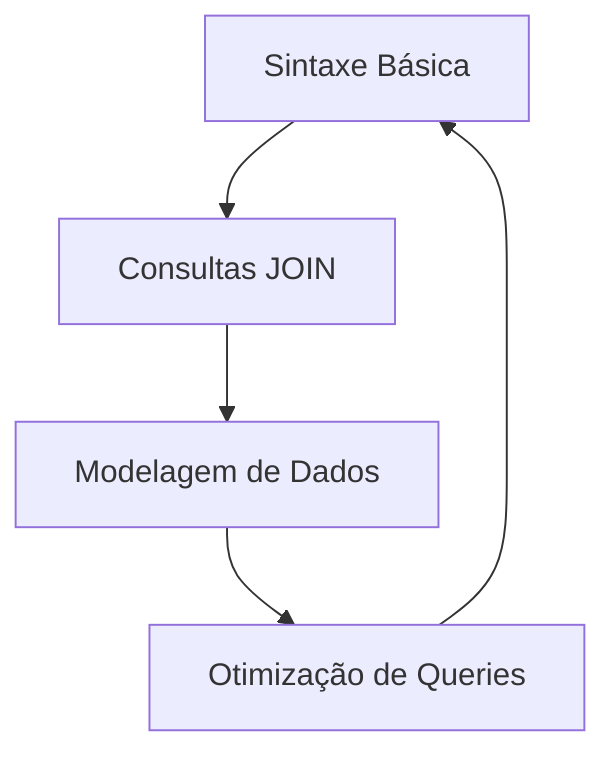

# Fundamentos de SQL (Structured Query Language)

O SQL é a linguagem padrão para interagir com bancos de dados relacionais.

## 01. Ciclo de Estudo SQL

## 02. Comandos Essenciais

| Comando | Função | Exemplo |
| :--- | :--- | :--- |
| **SELECT** | Seleciona dados de uma tabela. | `SELECT * FROM alunos` |
| **WHERE** | Filtra os resultados. | `WHERE nota > 7` |
| **JOIN** | Une duas tabelas relacionadas. | `JOIN pedidos ON clientes.id = pedidos.cli_id` |
| **GROUP BY** | Agrupa dados para cálculos. | `GROUP BY curso` |

---
