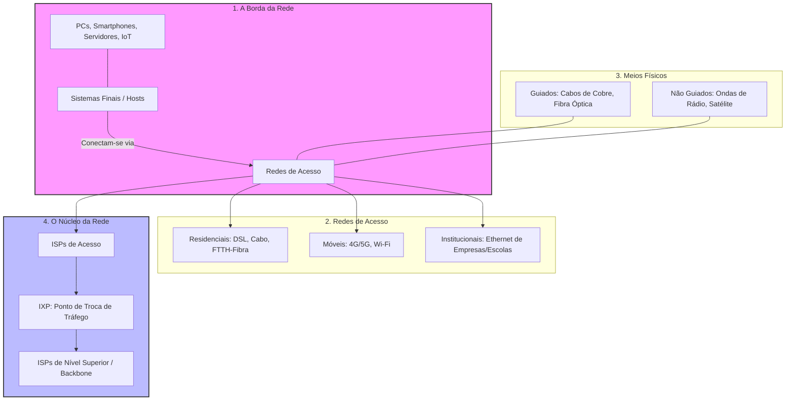
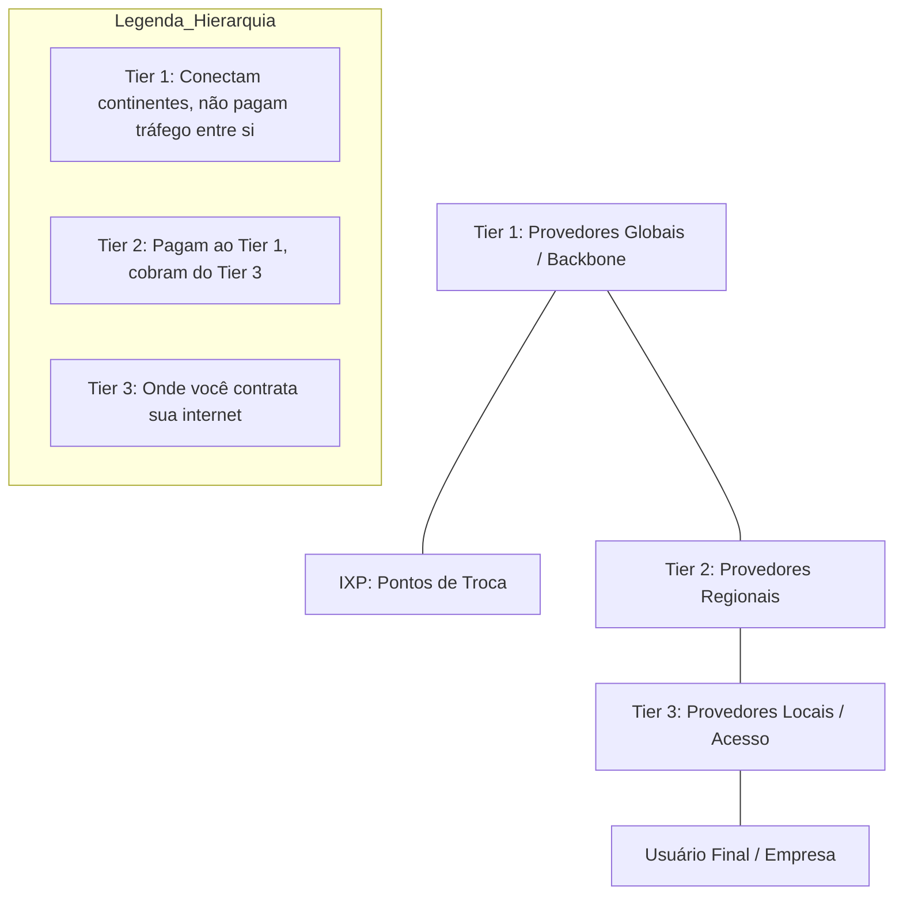

# Estudos de Arquitetura de Redes

Este documento contém a base teórica e visual sobre a infraestrutura da internet.

## 01. Arquitetura de Redes: A Borda e o Núcleo

Este fluxograma divide a internet em suas partes físicas e lógicas fundamentais.

### Explicação Teórica Direta (Definições de Limites)

1.  **Sistemas Finais (Hosts):** São os dispositivos que nós usamos (computadores, celulares). Eles ficam na "borda" porque são o ponto inicial ou final de qualquer dado.
2.  **Redes de Acesso:** É o caminho físico que liga o seu dispositivo ao primeiro roteador do seu provedor (ISP). 
    *   **Residenciais:** Conexões domésticas.
    *   **Institucionais:** Redes de empresas ou universidades.
3.  **Meios Físicos:** 
    *   **Guiados:** O sinal viaja dentro de um sólido (fio de cobre ou vidro da fibra).
    *   **Não Guiados:** O sinal viaja pelo ar (wireless).
4.  **Núcleo da Rede:** É a "malha" de roteadores que interconectam as redes de acesso em todo o mundo.
5.  **ISP (Internet Service Provider):** É a empresa (ex: Vivo, Claro) que te fornece acesso. Elas são organizadas em hierarquia (locais se conectam a regionais, que se conectam a globais).
6.  **IXP (Internet Exchange Point):** É um local físico onde diferentes ISPs se encontram para trocar dados diretamente entre si, tornando o tráfego mais rápido e barato.

## 02. Hierarquia de ISPs (Provedores)

A internet é uma "rede de redes". Elas se organizam em níveis (Tiers) baseados em sua abrangência.

## 03. Atrasos, Perda e Vazão (Métricas de Performance)

### Tipos de Atraso (Delay)
O atraso total de um pacote em um nó (roteador) é a soma de 4 componentes:

1.  **Processamento ($d_{proc}$):** Tempo para o roteador ler o cabeçalho e decidir para onde enviar. (Limite: Microsegundos).
2.  **Fila ($d_{queue}$):** Tempo que o pacote espera para ser transmitido. Depende do tráfego. (Limite: Variável).
3.  **Transmissão ($d_{trans}$):** Tempo para "empurrar" todos os bits do pacote para o cabo. Fórmula: $L/R$ ($L$ = bits, $R$ = velocidade do cabo).
4.  **Propagação ($d_{prop}$):** Tempo para o sinal viajar fisicamente pelo cabo (velocidade da luz). Fórmula: $Distância/Velocidade$.

### Equação do Atraso Fim a Fim (N+1)
Se você tem uma rede com **$N$** roteadores entre a origem e o destino, você terá **$N+1$** trechos (links) de conexão.
*   **Atraso Total de Transmissão** = $(N+1) \times (L/R)$
*   *Explicação:* Cada roteador precisa receber o pacote inteiro antes de enviar para o próximo link. Se há 2 roteadores, o pacote será transmitido 3 vezes ($N+1$).

### Influência dos Parâmetros nas Aplicações

| Parâmetro | Unidade | Definição Literal | Exemplo de Uso |
| :--- | :--- | :--- | :--- |
| **Latência (ms)** | Milissegundos | Tempo total de ida e volta do sinal. | Jogos Online (Ping < 50ms é ideal). |
| **Vazão (Mbps)** | Megabits/s | Quantidade de dados que passam por segundo. | Streaming 4K (Exige > 25 Mbps). |
| **Perda (Loss)** | Porcentagem % | Pacotes que "caem" quando a fila do roteador lota. | Chamadas de Vídeo (Causa travamentos). |

**Conceitos Importantes:**
*   **Latência (ms):** É a "velocidade de resposta". Se for alta, a ação demora a acontecer.
*   **Vazão (Throughput):** É a "largura do cano". Se for baixa, arquivos grandes demoram a baixar.
