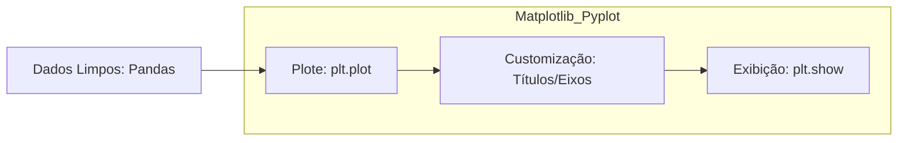

# Estudos de Visualização de Dados: Matplotlib

A biblioteca Matplotlib é usada para criar gráficos estáticos a partir de dados numéricos (Numpy/Pandas).

## 01. O Fluxo de Visualização

## 02. Comandos Fundamentais (O Martelo)

*   **`import matplotlib.pyplot as plt`**: Importação padrão da interface de gráficos.
*   **`plt.plot(x, y)`**: Cria um gráfico de linhas conectando os pontos (x, y).
*   **`plt.scatter(x, y)`**: Cria um gráfico de dispersão (pontos soltos), ideal para ver padrões em Machine Learning.
*   **`plt.show()`**: O comando final que renderiza o gráfico na memória e exibe na tela.

### Customização (Legibilidade):
1. **`plt.title("Título")`**: Nome do gráfico.
2. **`plt.xlabel("X")` / `plt.ylabel("Y")`**: Identificação dos eixos.

### Limite Técnico:
O Matplotlib é excelente para gráficos técnicos, mas se você tentar plotar milhões de pontos de uma vez, o computador pode travar devido ao custo de processamento gráfico.

---
